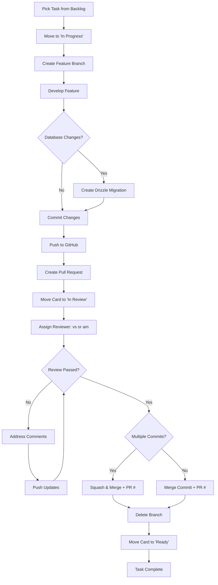

# Devlovers Technical Interview Platform - Contribution Guide

## Table of Contents

1. [Project Overview](#1-project-overview)
2. [Git Workflow and Naming Conventions](#2-git-workflow-and-naming-conventions)
3. [Pull Request Process](#3-pull-request-process)
4. [Development Guidelines](#4-development-guidelines)
5. [Development Workflow Diagram](#5-development-workflow-diagram)
6. [FAQ](#6-faq)
7. [Common Issues](#7-common-issues)

## 1. Project Overview

### 1.1. Tech Stack

- **Frontend**: Next.js 16 App Router, React 19, TypeScript
- **Database**: PostgreSQL (Neon serverless)
- **ORM**: Drizzle ORM
- **CMS**: Sanity (blog only)
- **Styling**: Tailwind CSS 4, Radix UI primitives
- **Icons**: Lucide React
- **Deployment**: Netlify
- **Version Control**: GitHub
- **Project Management**: GitHub Projects (Kanban board in repository)

### 1.2. Team Members & Initials

| Name              | Initials | Role          |
| ----------------- | -------- | ------------- |
| Lesia Soloviova   | `ls`     | Team member   |
| Alina Riabova     | `ar`     | Team member   |
| Andrew Motko      | `am`     | Code reviewer |
| Liudmyla Sovetovs | `lso`    | Team member   |
| Tetiana Zorii     | `tz`     | Team member   |
| Alex Kryvosheyin  | `ak`     | Team member   |
| Viktor Svertoka   | `vs`     | Code reviewer |
| Yevhenii Datsenko | `yd`     | Team member   |
| Yuliia Nazymko    | `yn`     | Team member   |
| Anna Komrakova    | `ako`    | Team member   |

## 2. Git Workflow and Naming Conventions

### 2.1 Branch Strategy

The project uses a **two-branch workflow** based on a simplified Git Flow model.

#### Main branches

- **`main`** — production / release branch

  - Contains only stable, production-ready code
  - Updated **only via scheduled releases** from `develop`
  - Direct pushes are forbidden
  - Protected by mandatory Pull Requests and reviews

- **`develop`** — integration branch (default)
  - All feature branches are merged here
  - May contain in-progress features
  - Used for active development
  - Protected by Pull Requests

#### Supporting branches

- **`feature/*`**

  - Created from `develop`
  - Used for new features and improvements
  - Merged back into `develop` via Pull Request

- **`hotfix/*`**
  - Created from `main`
  - Used for critical production fixes
  - Merged into `main` and back-merged into `develop`

### 2.2 Branch Creation Rules

All new work **must start from `develop`**:

```bash
git checkout develop
git pull origin develop
git checkout -b <initials>/<type>/<scope>/<description>
```

❌ Do NOT:

- Create feature branches from `main`

- Push directly to `main` or `develop`

### 2.3 Branch Naming

**Pull Request Title**

- **Tense**: Present tense
- **Case**: Lowercase with hyphens
- **Structure**: `{initials}/{type}/{scope}/{description}`

Examples:

- `ls/feat/quiz/add-timer-system`
- `ar/fix/quiz-api/slug-endpoint-bug`
- `fix: Resolve quiz result calculation bug`
- `vs/refactor/db/optimize-quiz-queries`

Delete branches after PR completion.

**Pull Request Description**

- Follow the template provided
- Link to GitHub issue if applicable
- Include migration steps for database changes
- Note any breaking changes
- Move card to "In Review" column on GitHub Projects board

**GitHub Projects Workflow**

1. **Backlog** → Task created, not started
2. **In Progress** → Actively working on feature
3. **In Review** → PR created, awaiting review
4. **Ready** → PR approved and merged

When creating PR, manually move your card from "In Progress" to "In Review".

### 2.4 Commit Messages

**Structure:** `type(scope): description`

**Types:**

- `feat`, `fix`, `refactor`, `docs`, `test`, `style`, `chore`, `db`

**Rules:**

- English only

- Subject line ≤ 50 characters

- Use commit body for details when needed

### 2.5 Pull Request Flow

- Feature branches → `develop`

- Release Pull Requests → `develop` → `main`

- Direct PRs to `main` are not **allowed** (except hotfixes)

### 2.6 Release Process (Weekly)

Releases are performed **once per week**.

1. Code freeze on `develop`

2. Create Pull Request: `develop` → `main`

3. Review and merge

4. Create Git tag (e.g. `v0.3.0`)

5. Publish GitHub Release

### 2.7 Handling Main Branch Updates

**Option 1: Merge (Recommended for Long-Running Branches)**

```bash
git fetch origin
git merge origin/main
git commit -m "merge: update branch with main"
```

**Option 2: Rebase (For Clean History)**

```bash
git fetch origin
git rebase origin/main
git push -f origin your-branch-name
```

**When to use:**

- **Merge**: Long-running branches, multiple contributors, preserve exact
  history
- **Rebase**: Short-lived branches, solo work, clean linear history

**Note**: Prefer merging over rebasing if PR is already open.

## 3. Pull Request Process

### 3.1 Pull Request Template

```markdown
## Description

<!-- Brief summary of changes -->

## Related Issue

<!-- Link to GitHub issue if applicable -->

**Issue**: #123

## Changes

- Item 1
- Item 2

## Database Changes (if applicable)

<!--
- [ ] Schema migration required
- [ ] Seed data updated
- [ ] Breaking changes to existing queries
- [ ] Tested migration locally
-->

## How Has This Been Tested?

<!-- Describe testing approach -->

- [ ] Tested locally
- [ ] Verified in development environment
- [ ] Checked responsive design (if UI changes)

## Screenshots (if applicable)

<!-- Add visual proof of changes -->

## Checklist

### Before submitting

- [ ] Self-reviewed code
- [ ] No new warnings/errors in console
- [ ] Discussed new dependencies with team (if any)
- [ ] English used throughout code/comments/docs
- [ ] Implemented only features within branch scope
- [ ] Database migration tested locally (if applicable)
- [ ] Verified PostgreSQL query performance (if applicable)
- [ ] Moved GitHub Projects card to "In Review"

### Pull Request Details

- [ ] Added appropriate labels
- [ ] Assigned reviewers (vs or am)
- [ ] Linked to relevant issue (if applicable)
```

### 3.2 Review and Merge Responsibility

**Required Reviewers:**

- Every PR must be reviewed by **Viktor Svertoka** (`vs`) OR **Andrew Motko**
  (`am`)
- PR cannot be merged without approval from one of these reviewers
- Other team members can provide comments but approval must come from designated
  reviewers

**After Approval:**

- Author completes the merge (reviewer does not merge for you)
- Choose appropriate merge strategy based on commit count
- Include PR number in merge/squash commit message
- Delete your branch after merging
- Move GitHub Projects card to "Ready" column

## 4. Development Guidelines

### 4.1 Project Structure

```
frontend/
├── app/                    # Next.js App Router
│   ├── about/             # Static pages
│   ├── api/               # API routes
│   ├── post/              # Blog pages
│   └── layout.tsx         # Root layout
├── components/
│   ├── quiz/              # Quiz-specific components
│   ├── shared/            # Business logic components
│   └── ui/                # Reusable UI primitives (Radix-based)
├── hooks/                 # Custom React hooks
├── db/
│   ├── schema/            # Drizzle schema definitions
│   ├── queries/           # Reusable query functions
│   └── seed*.ts           # Seed scripts
├── docs/                  # Technical documentation
└── lib/                   # Utilities
```

### 4.2 Database Guidelines

**Schema Changes:**

- Always create Drizzle migrations
- Test migrations on local Neon database first
- Document breaking changes in PR description
- Use transactions for multi-step changes
- Never modify production database directly

**Query Organization:**

- Put reusable queries in `/db/queries/`
- Keep API route handlers thin
- Optimize JOINs for performance
- Use proper indexes on foreign keys
- Test with realistic data volume

**Example Query Structure:**

```typescript
// db/queries/quiz.ts
export async function getQuizBySlug(slug: string) {
  const quiz = await db
    .select()
    .from(quizzes)
    .where(eq(quizzes.slug, slug))
    .limit(1);

  return quiz[0];
}
```

### 4.3 Component Guidelines

**Component Organization:**

- **UI Components** (`/components/ui/`): Radix-based primitives, no business
  logic
- **Shared Components** (`/components/shared/`): Reusable business components
- **Feature Components** (`/components/quiz/`): Feature-specific logic

**UI Component Rules:**

- Use Radix UI primitives as foundation
- Style with Tailwind CSS 4
- Use Lucide React for icons
- Export from `/components/ui/` for reusability
- Keep components pure and stateless when possible

**Example:**

```typescript
// ✅ Good: UI primitive
// components/ui/button.tsx
export const Button = ({ children, ...props }) => (
  <button className="btn-primary" {...props}>
    {children}
  </button>
);

// ✅ Good: Business component
// components/quiz/QuizContainer.tsx
export function QuizContainer({ slug }: Props) {
  const { data } = useQuiz(slug);
  return <QuizQuestion data={data} />;
}
```

### 4.4 Sanity CMS (Blog Only)

**Sanity Usage:**

- Used exclusively for blog content
- Schema defined in `/studio/schemaTypes/`
- Content includes: posts, authors, categories
- Do NOT use Sanity for quiz/user data

**Content Types:**

- `post`: Blog articles
- `author`: Article authors
- `category`: Blog categories
- `blockContent`: Rich text content

**Fetching Content:**

```typescript
// Use Sanity client for blog
import { client } from '@/lib/sanity';

const posts = await client.fetch(groq`
  *[_type == "post"] | order(publishedAt desc)
`);
```

### 4.5 API Routes

**Structure:**

- All API routes in `/app/api/`
- Use Route Handlers (Next.js 13+)
- Return JSON with proper status codes
- Handle errors consistently

**Example:**

```typescript
// app/api/quiz/[slug]/route.ts
export async function GET(
  request: Request,
  { params }: { params: { slug: string } }
) {
  try {
    const quiz = await getQuizBySlug(params.slug);
    if (!quiz) {
      return Response.json({ error: 'Quiz not found' }, { status: 404 });
    }
    return Response.json(quiz);
  } catch (error) {
    return Response.json({ error: 'Internal server error' }, { status: 500 });
  }
}
```

### 4.6 Scope of Work

**Stay Within Scope:**

- Implement only features related to your branch
- Do not fix unrelated bugs in the same PR
- Do not refactor unrelated code

**Discovered Bugs:**

- **Non-critical bugs**: Create separate GitHub issue, fix in new branch
- **Critical blockers**:
  - Create separate branch for fix, OR
  - Make separate commit with `fix` prefix in current branch

### 4.7 Code Standards

**TypeScript:**

- Use strict mode
- Define proper types (avoid `any`)
- Export types from component files when needed

**File Naming:**

- Components: PascalCase (`QuizContainer.tsx`)
- Utilities: camelCase (`utils.ts`)
- API routes: lowercase with hyphens (`quiz/[slug]/route.ts`)

**Styling:**

- Use Tailwind utility classes
- Avoid inline styles
- Use `cn()` utility for conditional classes
- Keep Tailwind classes organized (layout → spacing → colors)

**Example:**

```typescript
// ✅ Good
<div className={cn(
  "flex items-center gap-4",
  "p-4 rounded-lg",
  "bg-white dark:bg-gray-800",
  isActive && "border-2 border-blue-500"
)}>

// ❌ Bad
<div className="flex items-center gap-4 p-4 rounded-lg bg-white dark:bg-gray-800 border-2 border-blue-500">
```

## 5. Development Workflow Diagram



## 6. FAQ

### Q: How do I test database changes locally?

A:

1. Ensure you have `DATABASE_URL` in `.env.local`
2. Run migration: `npx drizzle-kit push`
3. Test with seed data: `npm run seed:categories` or create custom seed script
4. Never test on production database

### Q: What's the difference between content in Sanity vs PostgreSQL?

A:

- **Sanity**: Blog posts, authors, categories (CMS-managed content)
- **PostgreSQL**: Quiz data, user progress, application data (structured data
  with relations)

### Q: How do I add a new API route?

A:

1. Create folder in `/app/api/`
2. Add `route.ts` file
3. Export GET/POST/etc handlers
4. Return JSON with proper status codes
5. Handle errors consistently

### Q: Can I modify the database schema directly?

A: No. Always use Drizzle migrations. Direct schema changes will cause conflicts
and break migrations.

### Q: Which merge strategy should I use?

A:

- **1 commit**: Merge commit (preserves history)
- **Multiple commits**: Squash and merge (cleaner history)
- Always include PR number in final commit message

### Q: Who should I assign as reviewer?

A: Assign either **Viktor Svertoka** (`vs`) OR **Andrew Motko** (`am`). One
approval from these reviewers is required.

### Q: How do I organize components?

A:

- `/components/ui/`: Radix-based primitives, no logic
- `/components/shared/`: Reusable business components
- `/components/quiz/`: Quiz-specific components with logic

### Q: Where do I put database queries?

A: Put reusable queries in `/db/queries/`. Keep API routes thin by extracting
query logic.

### Q: How do I handle discovered bugs?

A:

- **Non-critical**: Create GitHub issue, fix in separate branch
- **Critical blocker**: Either create hotfix branch OR make separate `fix`
  commit in current branch

## 7. Common Issues

### 1. Neon Database Connection Errors

**Issue**: `ECONNREFUSED` or connection timeout

**Solution**:

- Verify `DATABASE_URL` in `.env.local`
- Check Neon dashboard - database might be suspended (free tier)
- Confirm correct connection string format
- Check network/firewall settings

### 2. Drizzle Migration Failures

**Issue**: Migration won't apply or generates errors

**Solution**:

- Check syntax in schema files
- Verify no conflicting changes
- Run `npx drizzle-kit generate` to regenerate
- Delete old migration files if needed
- Test on fresh local database

### 3. Next.js API Route Not Found (404)

**Issue**: API endpoint returns 404

**Solution**:

- Verify file is named `route.ts` (not `index.ts`)
- Check folder structure matches URL path
- Ensure proper export: `export async function GET()`
- Restart dev server after creating new routes
- Check for typos in dynamic parameters `[slug]`

### 4. TypeScript Type Errors with Drizzle

**Issue**: Type errors when querying database

**Solution**:

```typescript
// ✅ Good: Proper typing
const quiz = await db
  .select()
  .from(quizzes)
  .where(eq(quizzes.id, id))
  .limit(1);

const result = quiz[0]; // Type is inferred

// ❌ Bad: Using 'any'
const result: any = await db.select()...
```

### 5. Sanity Content Not Loading

**Issue**: Blog posts not appearing

**Solution**:

- Verify Sanity project ID in config
- Check API token in environment variables
- Confirm content is published (not draft)
- Test GROQ query in Sanity Vision
- Check CORS settings in Sanity dashboard

### 6. Tailwind Classes Not Working

**Issue**: Styles not applying

**Solution**:

- Ensure Tailwind 4 config is correct
- Check `globals.css` imports Tailwind
- Verify class names are valid Tailwind utilities
- Use `cn()` utility for dynamic classes
- Restart dev server after config changes

### 7. Radix UI Component Issues

**Issue**: Radix components not rendering properly

**Solution**:

- Check all required sub-components are imported
- Verify proper component composition
- Use `asChild` prop when needed
- Check for z-index conflicts with modals/popovers
- Review Radix UI documentation for component API

### 8. Quiz Anti-Cheat Not Triggering

**Issue**: `useAntiCheat` hook not working

**Solution**:

- Verify hook is called in client component
- Check browser console for visibility API errors
- Test in different browsers (Safari has limitations)
- Ensure event listeners are properly attached
- Check component is not server-side rendered

### 9. Git Merge Conflicts in Schema Files

**Issue**: Conflicts in `/db/schema/` files

**Solution**:

1. Communicate with team about schema changes
2. Pull latest main before starting schema work
3. If conflict occurs:
   - Keep both changes if independent
   - Regenerate migration after resolving
   - Test migration on clean database
4. Coordinate large schema changes with team

### 10. Environment Variables Not Loading

**Issue**: Process.env variables are undefined

**Solution**:

- File must be named `.env.local` (not `.env`)
- Variables must start with `NEXT_PUBLIC_` for client-side
- Restart dev server after changing env vars
- Never commit `.env.local` to git
- Check `.env.example` for required variables

---

**Document Version**: 1.1  
**Last Updated**: 2025-12-12  
**Maintained By**: Devlovers Team  
**Repository**: https://github.com/DevLoversTeam/devlovers.net
