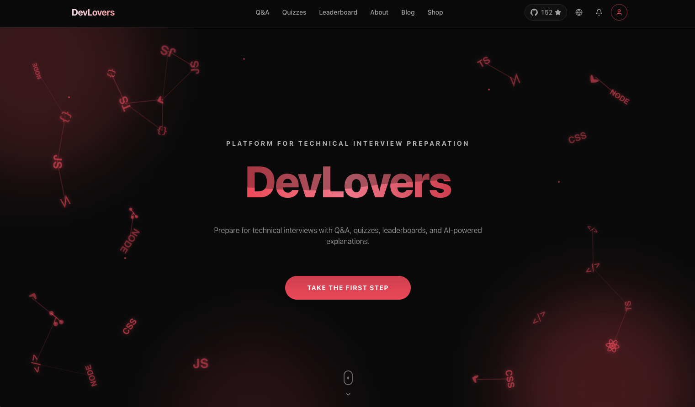
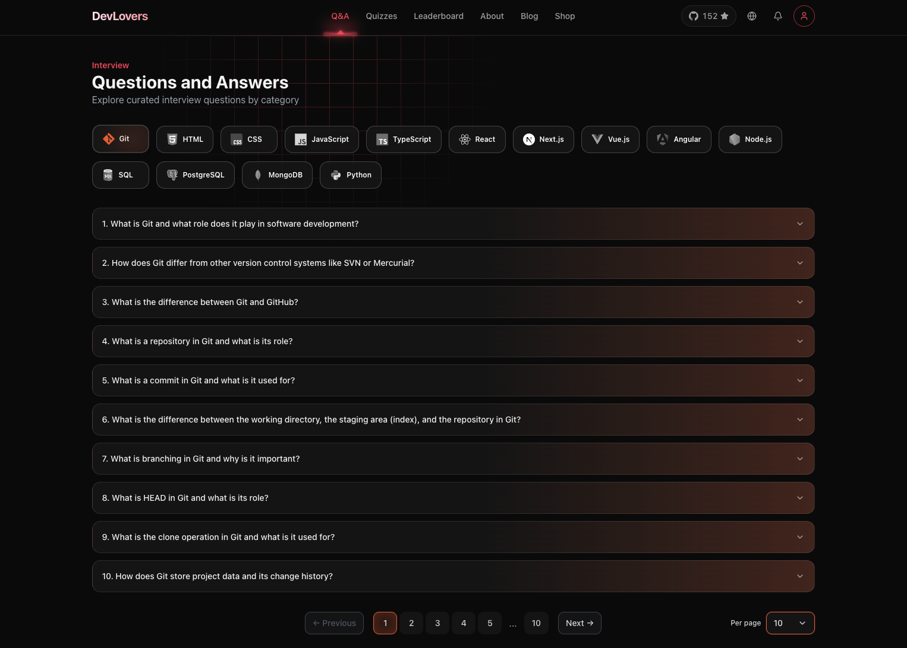
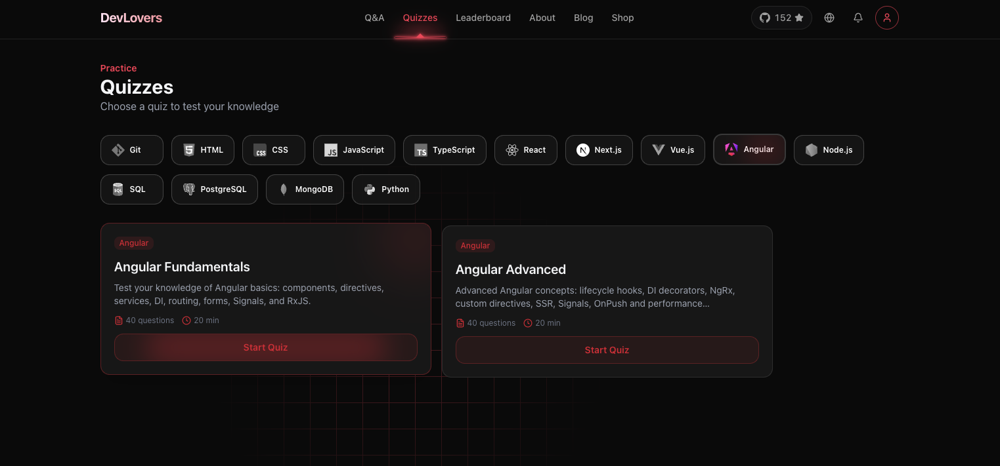
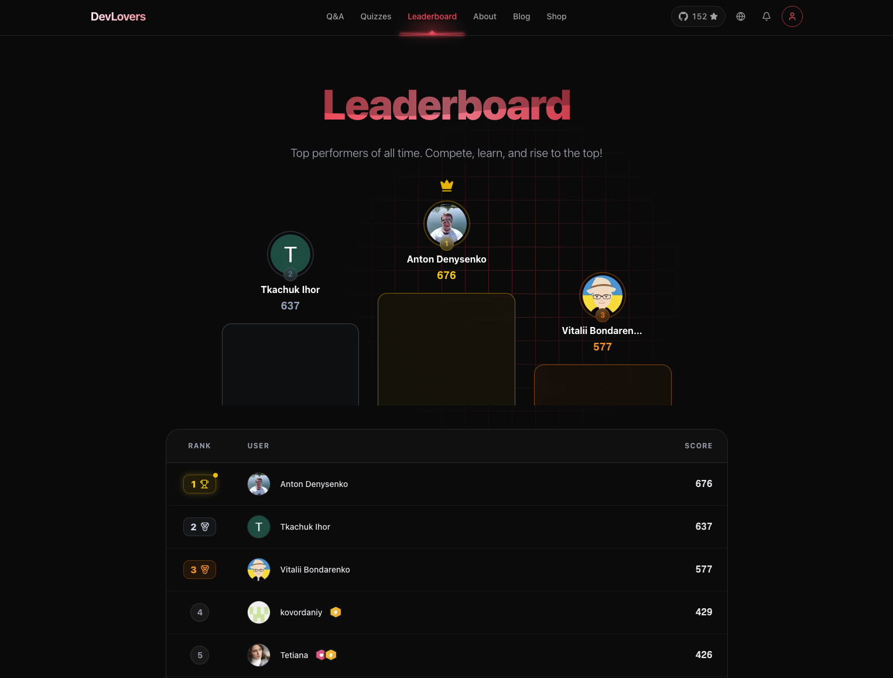
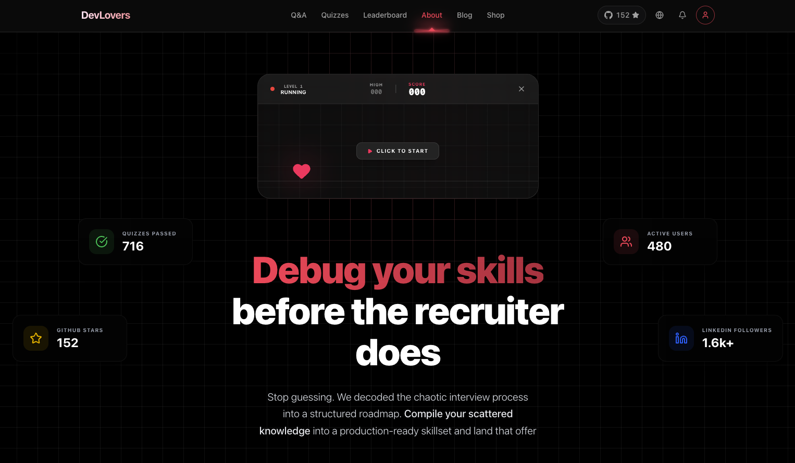
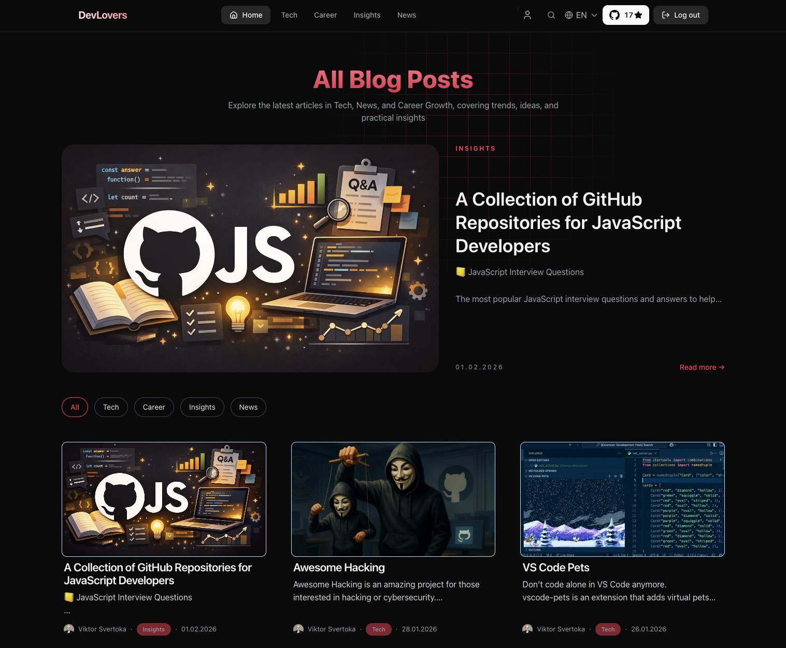
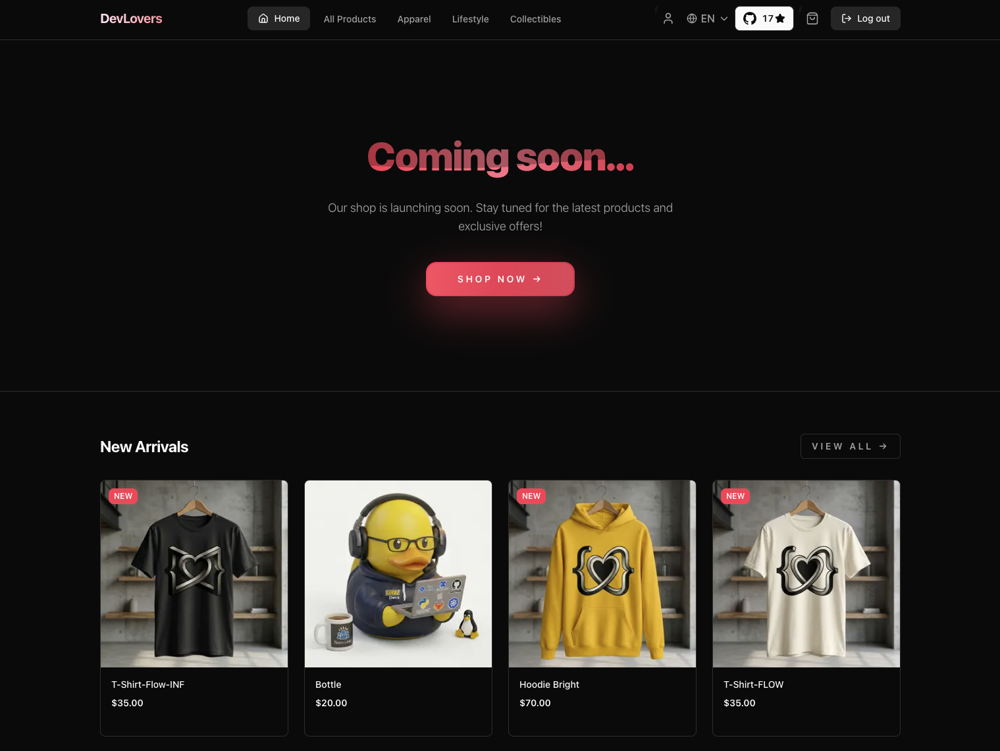
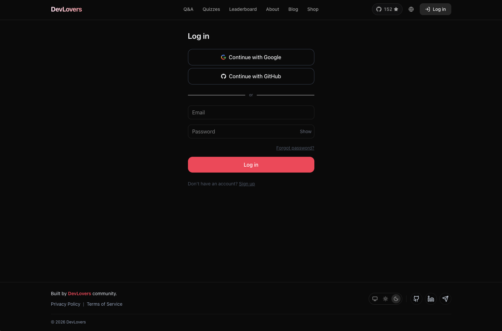

# DevLovers

A full-stack interview preparation platform for frontend, backend, and full-stack developers.

**Production:** [devlovers.net](https://devlovers.net)
**Develop:** [develop.devlovers.net](https://develop-devlovers.netlify.app)
[](https://app.netlify.com/projects/develop-devlovers/deploys)

## Overview

DevLovers helps developers prepare for technical interviews through:

- **Q&A Section** — Categorized interview questions (JavaScript, React, Node.js, etc.)
- **Quiz System** — Timed quizzes with anti-cheat, progress tracking, and leaderboards
- **Leaderboard** — Gamification with improvement-based scoring
- **Blog** — Technical articles managed via Sanity CMS
- **Shop** — E-commerce with Stripe payments and inventory management
- **About** — Landing page with platform stats, features overview, and community info

Supports three languages: Ukrainian, English, Polish.

## Tech Stack

| Category   | Technologies                        |
| ---------- | ----------------------------------- |
| Framework  | Next.js 16, React 19, TypeScript    |
| Styling    | Tailwind CSS v4, Framer Motion      |
| Database   | PostgreSQL (Neon), Drizzle ORM      |
| Caching    | Upstash Redis                       |
| CMS        | Sanity Studio, GROQ                 |
| UI         | Radix UI, Lucide Icons              |
| Auth       | JWT (jsonwebtoken), bcryptjs, OAuth |
| Payments   | Stripe                              |
| Email      | Nodemailer                          |
| i18n       | next-intl                           |
| AI         | Groq SDK                            |
| Testing    | Vitest, React Testing Library       |
| Media      | Cloudinary                          |
| Deployment | Vercel                              |

## Project Structure

```
devlovers.net/
├── frontend/               # Next.js application
│   ├── app/
│   │   ├── [locale]/       # Localized pages (uk/en/pl)
│   │   └── api/            # API routes
│   ├── components/         # React components
│   ├── db/
│   │   ├── schema/         # Drizzle table definitions
│   │   └── queries/        # Reusable DB queries
│   ├── hooks/              # Custom React hooks
│   ├── i18n/               # Internationalization config
│   ├── lib/                # Utilities and business logic
│   └── messages/           # Translation files (JSON)
│
└── studio/                 # Sanity CMS
    └── schemaTypes/        # Content schemas (posts, authors)
```

## Main Features

### Home

- Minimal first landing page
- Multi-language support
- Theme switching



### Q&A

- Categorized technical questions
- AI-powered Word Helper for explanations
- Multi-language content



### Quiz System

- Multiple-choice quizzes with countdown timer
- Anti-cheat protection (tab switch detection, copy prevention)
- Guest mode with post-auth sync
- Per-quiz progress tracking



### Leaderboard

- Points system with improvement-based scoring
- Top players podium
- Integrity-filtered rankings



### About

- Mission-driven page explaining DevLovers vision, values, and interview-first approach
- Highlights platform impact, community growth, and real preparation over guessing



### Blog

- Technical articles via Sanity CMS
- Category and tag filtering
- Search with pagination
- Multi-language content (uk/en/pl)



### Shop

- Product catalog with filtering
- Stripe checkout
- Admin panel for orders and inventory



### Authentication

- Email/password with verification
- OAuth (Google, GitHub)
- Password reset flow



## Getting Started

```bash
# Install dependencies
cd frontend && npm install

# Set up environment variables
cp .env.example .env.local

# Run development server
npm run dev

# Database commands
npx drizzle-kit generate   # Generate migrations
npx drizzle-kit push       # Apply migrations
```

## Git Workflow

- `main` — production branch
- `develop` — development branch
- Feature branches: `prefix/feat/feature-name`

Task tracking via [GitHub Projects](https://github.com/DevLoversTeam/devlovers.net/projects) board.

## License

**MIT**
