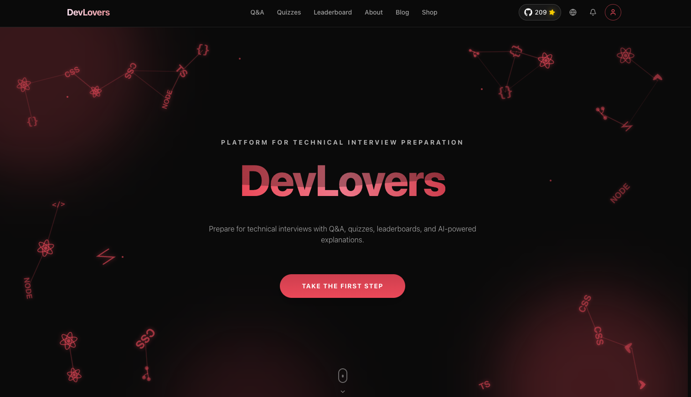
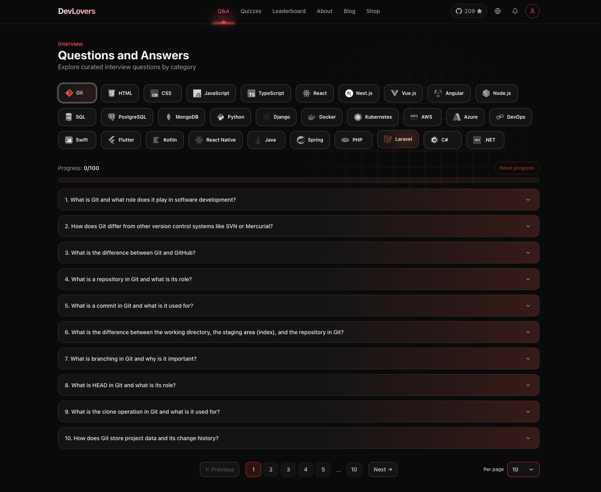
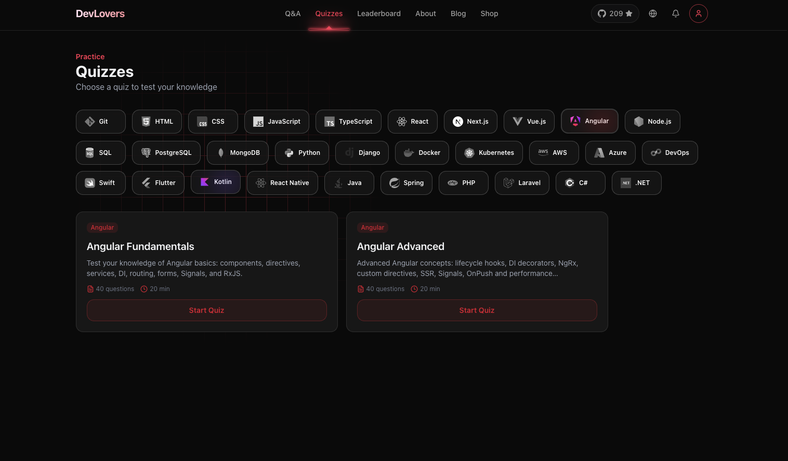
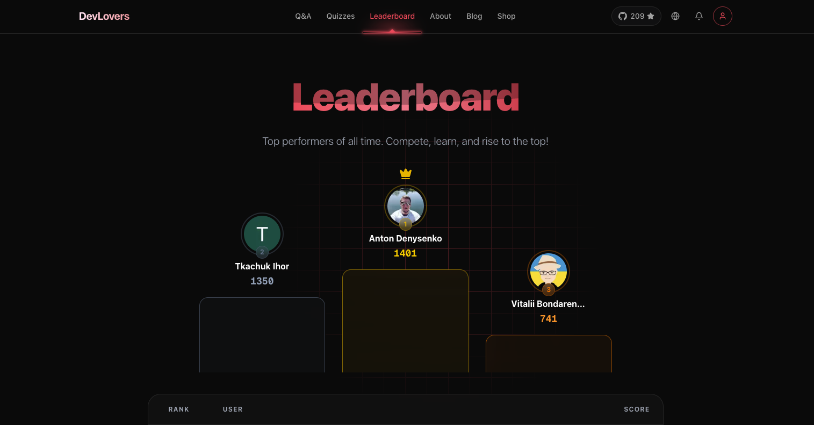
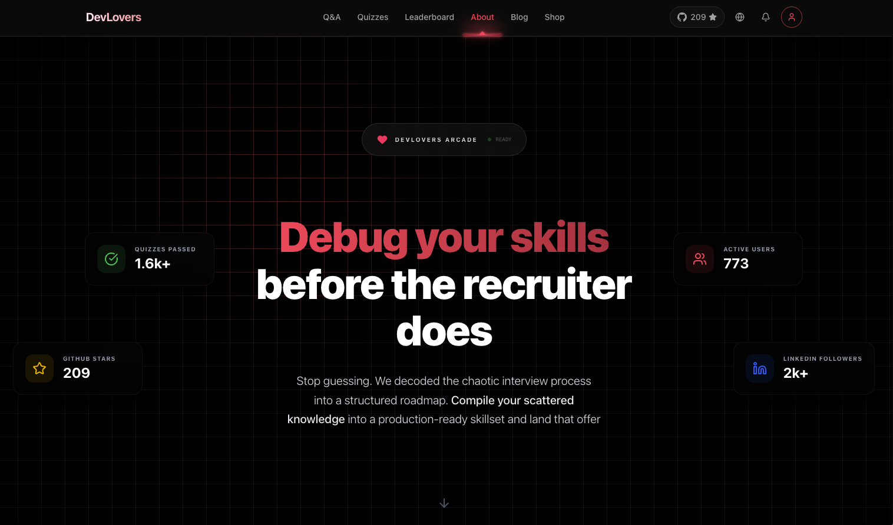
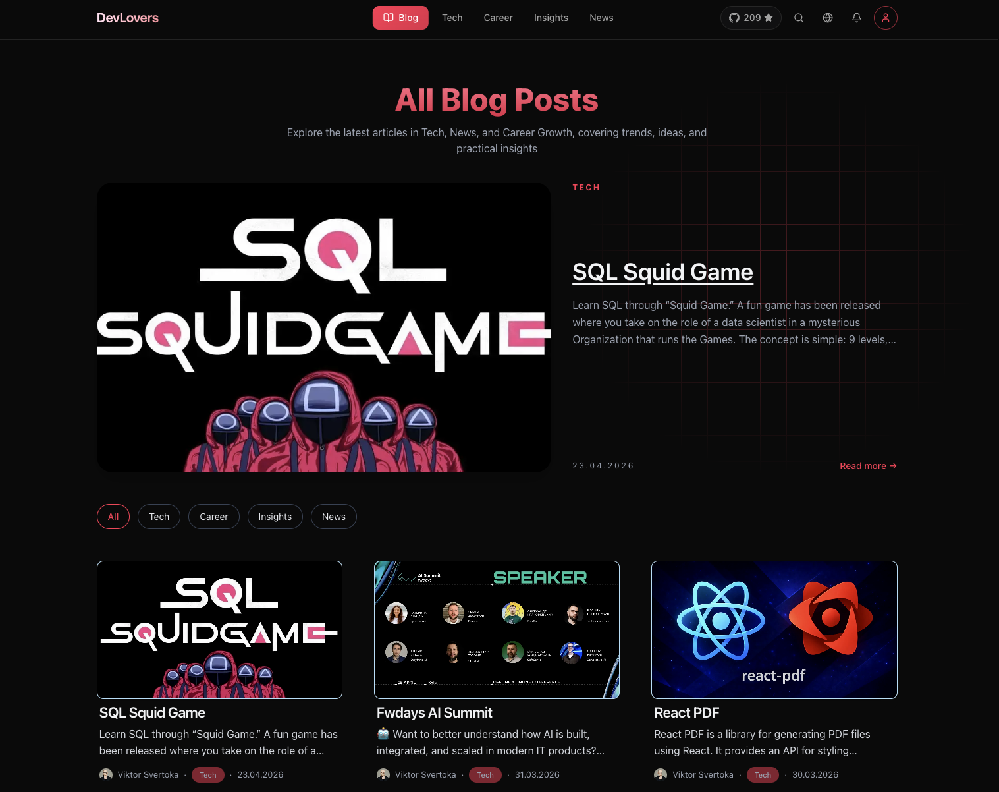
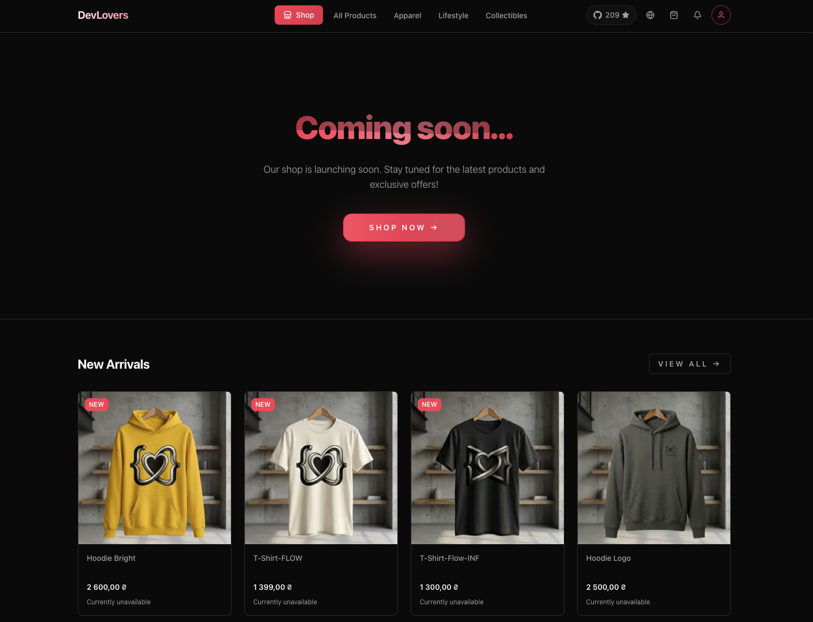
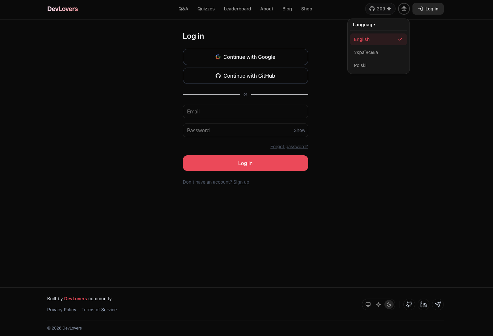
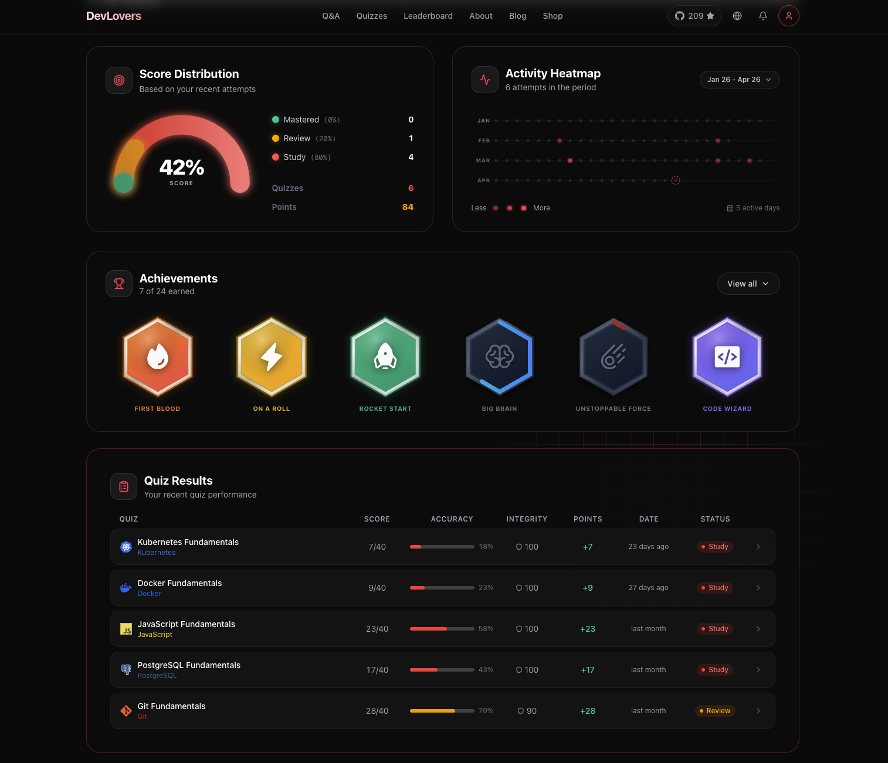

# DevLovers Technical Interview Platform

> [!NOTE]
>
> ### Train smarter, interview stronger.
>
> DevLovers is a multi-language interview prep platform with curated Q&A, timed quizzes, leaderboard rankings, a developer blog, and a personal dashboard to track real learning progress.

## Main Features

### Home

- Minimal first landing page
- Multi-language support
- Theme switching

### Q&A

- Categorized technical questions
- AI-powered Word Helper for explanations
- Multi-language content

### Quiz System

- Multiple-choice quizzes with countdown timer
- Anti-cheat protection (tab switch detection, copy prevention)
- Guest mode with post-auth sync
- Per-quiz progress tracking

### Leaderboard

- Points system with improvement-based scoring
- Top players podium
- Integrity-filtered rankings

### About

- Mission-driven page explaining DevLovers vision, values, and interview-first approach
- Highlights platform impact, community growth, and real preparation over guessing

### Blog

- Technical articles via custom in-house admin panel
- Category and tag filtering
- Search with pagination
- Multi-language content (uk/en/pl)

### Shop

- Product catalog with filtering
- Stripe checkout
- Admin panel for orders and inventory

### Authentication

- Email/password with verification
- OAuth (Google, GitHub)
- Password reset flow

## Dashboard

- Personal learning dashboard with progress insights
- Quiz history and performance overview
- Quick access to key account activity

> [!IMPORTANT]
> **Contact me:** [contact@devlovers.net](mailto:contact@devlovers.net)

> [!TIP]
> **Production:** [devlovers.net](https://devlovers.net)
>
> **Develop:** [develop.devlovers.net](https://develop-devlovers.netlify.app) 
