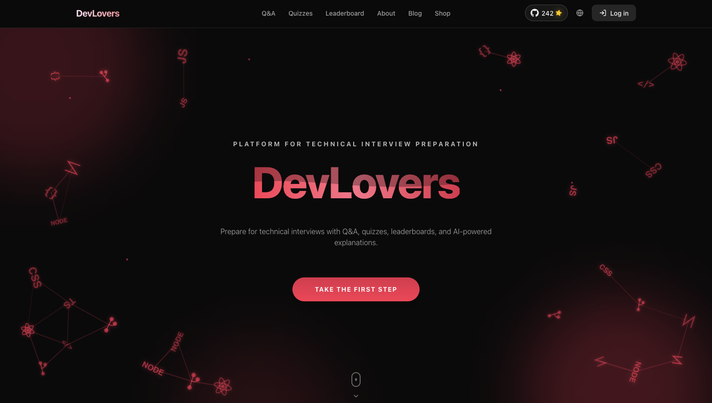
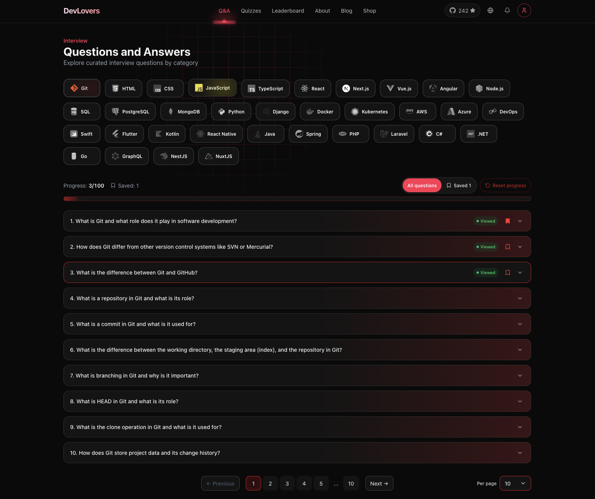
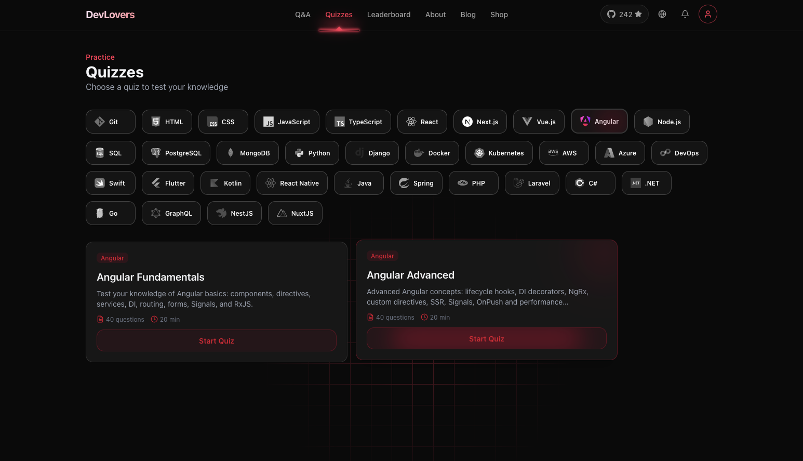
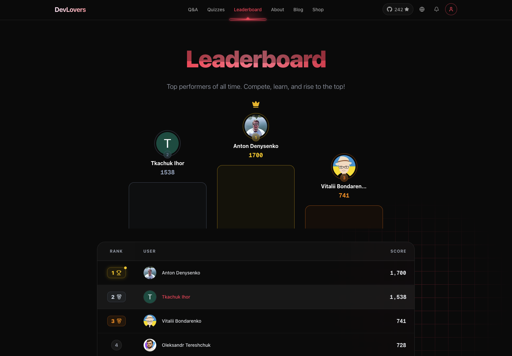
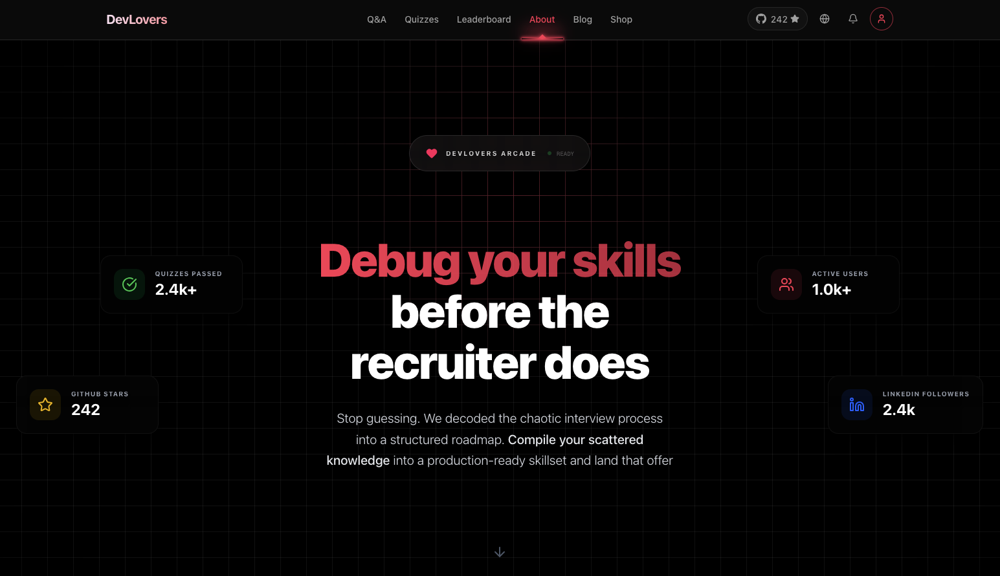
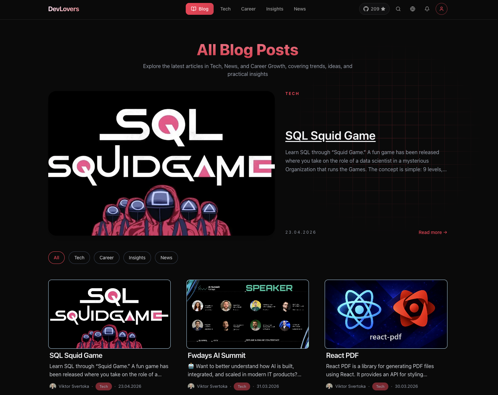
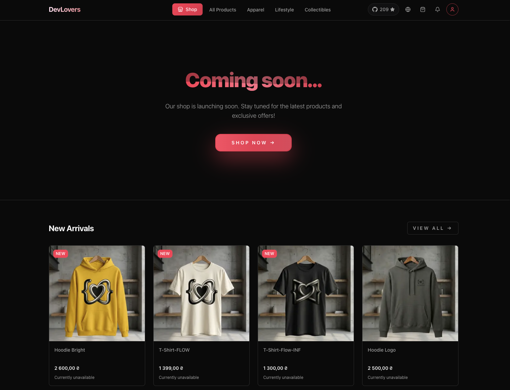
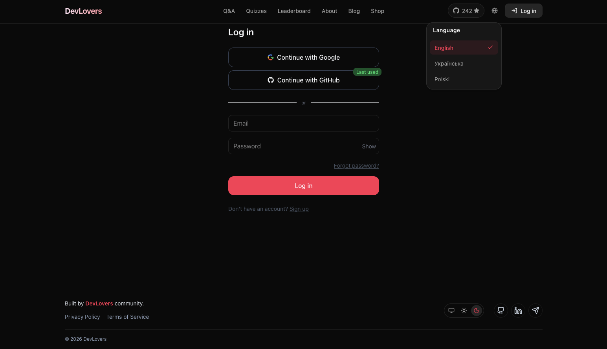
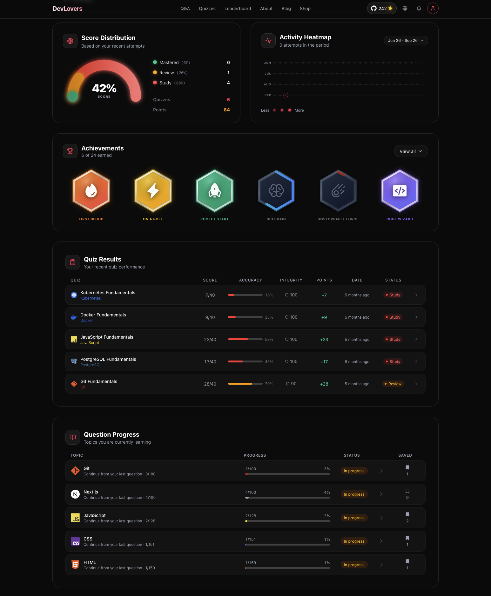

# DevLovers Technical Interview Platform

> [!NOTE]
>
> ### Train smarter, interview stronger.
>
> DevLovers is a multi-language interview prep platform with curated Q&A, timed quizzes, leaderboard rankings, a developer blog, and a personal dashboard to track real learning progress.

## Main Features

### Home

- Interview preparation landing page with a clear call to action
- Navigation to Q&A, quizzes, leaderboard, blog, and shop
- English, Ukrainian, and Polish interfaces with light, dark, and system themes

### Q&A

- Technical questions organized by language, framework, and tool
- Viewed-question tracking, saved questions, and progress reset
- Paginated question lists with adjustable page size
- AI-powered Word Helper for explanations and multi-language content

### Quiz System

- Quiz catalog filtered by technology, with question counts and time limits
- Multiple-choice quizzes with countdown timer
- Anti-cheat protection (tab switch detection, copy prevention)
- Guest mode with post-auth sync
- Per-quiz progress tracking

### Leaderboard

- Points system with improvement-based scoring
- Top-three podium and a ranked table with player scores
- Integrity-filtered rankings

### About

- Interview preparation mission centered on structured practice and practical skills
- Community highlights for quizzes passed, active users, GitHub stars, and LinkedIn followers

### Blog

- Featured articles and a post grid covering Tech, Career, Insights, and News
- Article previews with author, category, and publication date
- Category and tag filtering
- Search with pagination
- Multi-language content (uk/en/pl)

### Shop

- Product catalog with filtering
- Stripe checkout
- Admin panel for orders and inventory

### Authentication

- Email/password with verification
- Google and GitHub sign-in with a last-used provider indicator
- Password reset flow

### Dashboard

- Score distribution with Mastered, Review, and Study categories
- Activity heatmap and achievement badges
- Quiz results with scores, accuracy, integrity, earned points, and status
- Q&A progress by topic, saved-question counts, and links to continue learning

> [!IMPORTANT]
> **Contact me:** [contact@devlovers.net](mailto:contact@devlovers.net)

> [!TIP]
> **Production:** [devlovers.net](https://devlovers.net)
>
> **Develop:** [develop.devlovers.net](https://develop-devlovers.netlify.app) 
