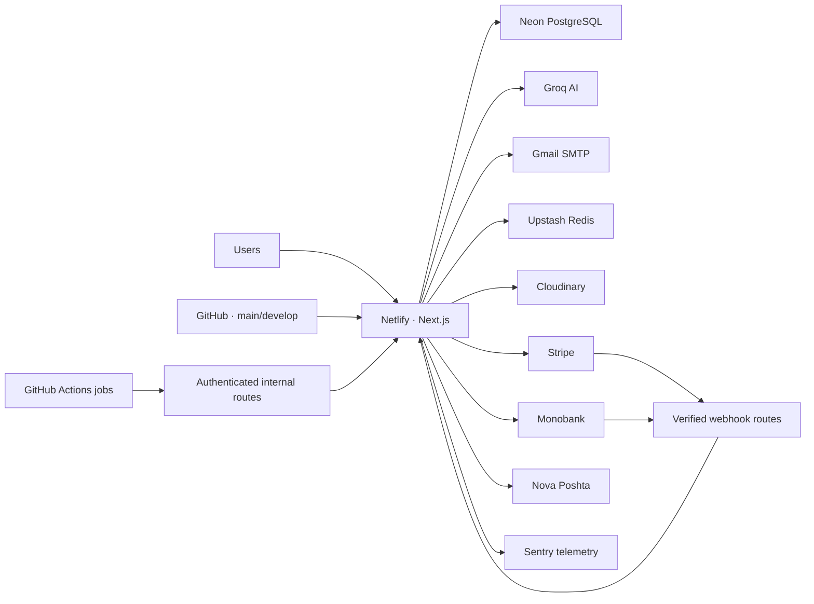

# DevLovers Production Runbook

Operational guide for the DevLovers production and development environments.

Current infrastructure:

- **Netlify** — Next.js application hosting, builds, branch deploys, and runtime logs;
- **Neon PostgreSQL** — application and shop database;
- **Drizzle ORM / Drizzle Kit** — runtime queries and schema migrations;
- **GitHub Actions** — security checks and selected scheduled shop jobs;
- **Sentry** — application error and performance telemetry when configured;
- **Stripe and Monobank** — payment providers;
- **Nova Poshta** — supported Ukrainian shipping provider;
- **Cloudinary** — shop and blog image storage when configured;
- **Gmail SMTP** — verification, password reset, feedback, and shop email delivery;
- **Groq** — AI Term Helper provider;
- **Upstash Redis** — distributed rate limiting and selected transient controls when configured.

> DevLovers is deployed on Netlify. Do not apply Vercel deployment, rollback, environment-variable, log, or cron procedures to this project merely because some compatibility variables in the code still use `VERCEL_*` names.

## Contents

1. [Purpose and boundaries](#1-purpose-and-boundaries)
2. [Production topology](#2-production-topology)
3. [Environments and sources of truth](#3-environments-and-sources-of-truth)
4. [Access and secrets](#4-access-and-secrets)
5. [Daily operational check](#5-daily-operational-check)
6. [Availability and readiness checks](#6-availability-and-readiness-checks)
7. [Standard deployment](#7-standard-deployment)
8. [Drizzle migrations](#8-drizzle-migrations)
9. [Scheduled and internal jobs](#9-scheduled-and-internal-jobs)
10. [Payments and webhooks](#10-payments-and-webhooks)
11. [Neon backup and restore](#11-neon-backup-and-restore)
12. [Application rollback](#12-application-rollback)
13. [Incident response](#13-incident-response)
14. [Common incidents](#14-common-incidents)
15. [Smoke test](#15-smoke-test)
16. [Useful read-only database checks](#16-useful-read-only-database-checks)
17. [Incident record](#17-incident-record)
18. [Operational references](#18-operational-references)

---

## 1. Purpose and boundaries

Use this runbook for:

- production and development releases;
- Netlify build and runtime investigation;
- applying Drizzle migrations to Neon;
- application rollback;
- database backup and restore coordination;
- authentication, Q&A, quiz, dashboard, blog, and shop recovery;
- payment, webhook, order, inventory, notification, and shipping incidents;
- scheduled job verification;
- production incident documentation.

This runbook does not authorize deletion or rewriting of production data. Destructive SQL, a database restore, payment reversal, secret rotation, production branch changes, and manual execution of write-heavy internal jobs require an authorized operator, an exact target, and a recorded recovery plan.

### Safety rules

- Confirm the Netlify site, deploy context, Neon project, and Neon branch before any change.
- Never copy production secrets into commits, tickets, screenshots, chat, or incident documents.
- Prefer read-only verification before mutation.
- Keep application rollback and database recovery as separate decisions.
- Do not replay a payment webhook manually unless the provider event and idempotency state have been verified.
- Do not edit an already applied migration file.
- Do not run schema reset, broad delete, or truncation commands in production.

---

## 2. Production topology



### Production components

| Component | Source of truth | Operational surface |
|---|---|---|
| Application code | GitHub `main` | Netlify production deploys |
| Integration code | GitHub `develop` | Netlify develop branch deploy |
| Build configuration | [`netlify.toml`](./netlify.toml) | Netlify build settings and logs |
| Runtime configuration | Netlify environment variables | Netlify project configuration |
| Database schema | `frontend/db/schema` + `frontend/drizzle` | Drizzle Kit and Neon |
| Application data | Neon production branch | Neon console and SQL editor |
| Scheduled janitor | `.github/workflows/shop-janitor-restock-stale.yml` | GitHub Actions |
| Payment state | Neon + verified provider events | Admin shop, logs, Stripe/Monobank consoles |
| Images | Cloudinary when enabled | Cloudinary console and admin upload flows |
| Error telemetry | Sentry when configured | Sentry project |

### Runtime rules

- Production traffic is served from [devlovers.net](https://devlovers.net).
- The `main` branch is the production/release branch.
- The `develop` branch is the integration branch and is deployed to [develop-devlovers.netlify.app](https://develop-devlovers.netlify.app).
- The Netlify build base is `frontend`.
- Netlify uses Node.js `20.19.0` from [`netlify.toml`](./netlify.toml).
- The build command is `npm ci --include=optional && node scripts/generate-env-runtime.mjs && npm run build`.
- The build does not apply database migrations automatically.
- Runtime database access uses `DATABASE_URL` with Neon HTTP through `@neondatabase/serverless`.
- Local development uses `DATABASE_URL_LOCAL` only when `APP_ENV=local` and no production `DATABASE_URL` is selected.
- Environment-variable changes affect only builds or functions that receive the new configuration. Trigger a fresh deploy after changing build-time or public variables.

---

## 3. Environments and sources of truth

### Environment matrix

| Environment | Expected `APP_ENV` | Code source | Database |
|---|---|---|---|
| Local | `local` | Developer branch | Local PostgreSQL through `DATABASE_URL_LOCAL` |
| Develop | `develop` | `develop` | Dedicated non-production Neon branch/database |
| Production | `production` | `main` | Neon production branch/database |

Do not point develop or Preview deploys to the production database unless an incident owner explicitly approves the temporary risk and documents why it is necessary.

### Git workflow

- Feature branches start from `develop` and merge back through a pull request.
- Releases move from `develop` to `main` through a reviewed release pull request.
- Hotfixes start from `main`, are released to `main`, and are then back-merged into `develop`.
- Record the released commit SHA and application version from `frontend/package.json`.

Detailed contribution rules live in [`.github/CONTRIBUTING.md`](./.github/CONTRIBUTING.md).

### Generated runtime environment file

`frontend/scripts/generate-env-runtime.mjs` writes `frontend/lib/env/runtime-env.generated.ts` during Netlify builds.

- For `APP_ENV=develop`, selected environment values can be embedded as a server-only fallback.
- For any other `APP_ENV`, the generated map is deliberately empty.
- The file is generated from keys listed in `frontend/.env.example`.
- Never commit generated secret values.
- Production must receive secrets from the Netlify runtime/build environment, not from the generated fallback file.

If develop works but production reports missing variables, check `APP_ENV`, Netlify variable scopes, and the generated-env build log before changing application code.

---

## 4. Access and secrets

Production operators should have only the access required for their role:

- GitHub repository and protected branches;
- Netlify site, deploys, environment variables, and logs;
- Neon project and production branch;
- Sentry project;
- Stripe and/or Monobank merchant consoles;
- Nova Poshta business account when shipping is enabled;
- Cloudinary account for media incidents;
- Gmail account or SMTP credentials for email incidents;
- Upstash project for rate-limit incidents.

### Core variables

| Variable | Requirement | Purpose |
|---|---|---|
| `APP_ENV` | Required | `local`, `develop`, or `production` environment selection |
| `DATABASE_URL` | Required outside local | Neon PostgreSQL runtime and migration connection |
| `DATABASE_URL_LOCAL` | Required only for local mode | Local PostgreSQL connection |
| `AUTH_SECRET` | Required | Signs the seven-day `auth_session` JWT cookie |
| `CSRF_SECRET` | Required for protected mutations | CSRF token protection |
| `APP_ORIGIN` | Required in production | Canonical same-origin security allowlist |
| `APP_ADDITIONAL_ORIGINS` | Optional | Comma-separated additional trusted origins |
| `NEXT_PUBLIC_SITE_URL` | Recommended | Canonical public URL and metadata base |
| `ENABLE_ADMIN_API` | Required for admin API | Server-side admin feature flag |
| `NEXT_PUBLIC_ENABLE_ADMIN` | Required for admin UI | Client-visible admin navigation flag |

### Authentication and email

| Variable group | Purpose |
|---|---|
| `GOOGLE_CLIENT_ID_PROD`, `GOOGLE_CLIENT_SECRET_PROD`, `GOOGLE_CLIENT_REDIRECT_URI_PROD` | Production Google OAuth |
| `GITHUB_CLIENT_ID_PROD`, `GITHUB_CLIENT_SECRET_PROD`, `GITHUB_CLIENT_REDIRECT_URI_PROD` | Production GitHub OAuth |
| Corresponding `_DEVELOP` and `_LOCAL` variables | Non-production OAuth clients and callbacks |
| `GMAIL_USER`, `GMAIL_APP_PASSWORD`, `EMAIL_FROM` | Verification, password reset, feedback, and shop email |

OAuth callback URLs must match the locale-independent API routes and the exact deployed origin configured at the provider. Never reuse production OAuth credentials for an untrusted Preview deploy.

### AI, rate limits, telemetry, and media

| Variable group | Purpose |
|---|---|
| `GROQ_API_KEY` | AI Term Helper |
| `UPSTASH_REDIS_REST_URL`, `UPSTASH_REDIS_REST_TOKEN` | Distributed rate limiting and transient controls |
| `NEXT_PUBLIC_SENTRY_DSN` | Sentry client/server telemetry |
| `CLOUDINARY_CLOUD_NAME`, `CLOUDINARY_API_KEY`, `CLOUDINARY_API_SECRET` | Image uploads and deletion |
| `CLOUDINARY_UPLOAD_FOLDER` | Cloudinary folder, default `products` |
| `LOG_LEVEL` | Structured application log threshold |

Sentry initialization currently recognizes `NODE_ENV=production` and also reads several `VERCEL_*` compatibility variables for environment/release labels. On Netlify, verify that events arrive with useful environment and release metadata after every telemetry-related change; do not assume those compatibility values are populated automatically.

### Shop payments and internal jobs

| Variable group | Purpose |
|---|---|
| `PAYMENTS_ENABLED` | Global payment gate |
| `STRIPE_PAYMENTS_ENABLED`, `STRIPE_MODE` | Stripe rail and live/test mode |
| `STRIPE_SECRET_KEY`, `NEXT_PUBLIC_STRIPE_PUBLISHABLE_KEY`, `STRIPE_WEBHOOK_SECRET` | Stripe checkout and webhook verification |
| `MONO_MERCHANT_TOKEN`, `MONO_PUBLIC_KEY`, `MONO_API_BASE` | Monobank checkout and webhook verification |
| `MONO_WEBHOOK_MODE` | `apply`, `store`, or `drop` webhook behavior |
| `MONO_REFUND_ENABLED` | Monobank refund gate; disabled for the current launch policy |
| `SHOP_STATUS_TOKEN_SECRET` | Guest order-status token; at least 32 characters |
| `SHOP_BASE_URL` | Canonical shop callback origin when set |
| `INTERNAL_JANITOR_SECRET` | Authentication for internal shop jobs |
| `JANITOR_URL` | Full scheduled janitor endpoint used by GitHub Actions |

Production Stripe configuration is fail-closed: `STRIPE_MODE` must be `live`, and live keys must have the expected production prefixes when the rail is enabled.

### Shipping

| Variable group | Purpose |
|---|---|
| `SHOP_SHIPPING_ENABLED` | Global shipping gate |
| `SHOP_SHIPPING_NP_ENABLED` | Nova Poshta shipping gate |
| `SHOP_SHIPPING_SYNC_ENABLED` | Nova Poshta catalog synchronization |
| `SHOP_SHIPPING_RETENTION_ENABLED`, `SHOP_SHIPPING_RETENTION_DAYS` | Shipping-data retention worker |
| `NP_API_KEY`, `NP_API_BASE` | Nova Poshta API access |
| `NP_SENDER_*` | Sender, city, warehouse, contact, phone, and optional EDRPOU |

### Secret handling

- Never prefix server secrets with `NEXT_PUBLIC_`.
- Do not print secret values in Netlify or GitHub Actions logs.
- After rotating `AUTH_SECRET`, all existing sessions become invalid; announce the expected logout.
- After rotating OAuth credentials, update the provider callback configuration and redeploy.
- After rotating Stripe or Monobank webhook credentials, coordinate both the provider and Netlify change so events are not lost.
- Keep old webhook secrets only for the shortest provider-supported overlap window.
- Rotate `INTERNAL_JANITOR_SECRET` in Netlify and GitHub Actions together.
- Redeploy after changing variables consumed during build or module initialization.

---

## 5. Daily operational check

Recommended daily check:

1. Open the Netlify production deploy and confirm the status is published/ready.
2. Open `https://devlovers.net/en` and verify a successful response.
3. Check `/api/auth/me`; a signed-out request should return HTTP 200 with `null`.
4. Open `/en/q&a`, `/en/quizzes`, `/en/blog`, and `/en/shop/products`.
5. Review Netlify function logs for new 5xx spikes and repeated timeout patterns.
6. Review Sentry for new unresolved errors, regressions, and release spikes.
7. Check the latest **Shop janitor - restock stale orders** GitHub Actions run.
8. If payments are enabled, review webhook delivery health in Stripe and Monobank.
9. Review admin orders for `needs_review`, stale `pending`, failed inventory, or shipping `needs_attention` states.
10. Check Neon monitoring for unusual compute, connection, storage, or query changes.

Do not run a real payment or a write-heavy worker as part of a routine daily check unless a dedicated test order and reconciliation procedure exist.

---

## 6. Availability and readiness checks

DevLovers currently has no dedicated `/api/health` endpoint. Do not document or monitor one until it is implemented.

Use layered checks instead.

### Layer 1: static application availability

```text
GET /en
GET /en/about
```

Expected: HTTP 200 with the current deployment content.

### Layer 2: runtime and authentication route

```text
GET /api/auth/me
```

Expected when signed out: HTTP 200 with JSON `null` and `Cache-Control: no-store`.

This confirms the Next.js function runtime and auth module load, but it does not prove a database query succeeds.

### Layer 3: database-backed public flows

Check at least one of:

```text
GET /en/quizzes
GET /api/questions/git?page=1&limit=10&locale=en
GET /api/shop/catalog?page=1&limit=1&locale=en
```

Expected: HTTP 200 and structurally valid content. The catalog can legitimately return an empty product list, but it must not return `INTERNAL_ERROR`.

### Layer 4: authenticated flow

With a production test account:

1. Log in.
2. Open `/en/dashboard`.
3. Confirm profile, quiz statistics, and Q&A progress load.
4. Open one Q&A answer and confirm progress synchronization.
5. Log out.

### Failure interpretation

| Observation | Likely area |
|---|---|
| Static pages and API routes both fail | Netlify deploy, domain, routing, or broad runtime incident |
| Static page works; database-backed routes fail | Neon connectivity, schema, or query regression |
| Public database routes work; dashboard fails | Auth cookie, user data, session secret, or protected query |
| Platform works; shop fails | Payment/shipping env validation, shop schema, or catalog query |
| Browser works; Sentry is empty | Telemetry configuration rather than application availability |

---

## 7. Standard deployment

Run commands from `frontend/` unless stated otherwise.

### Before release

1. Confirm the release branch is based on the expected `develop` commit.
2. Review the diff for secrets, `.env` files, database exports, personal data, and destructive SQL.
3. Install exactly from the lockfile:

```bash
npm ci --include=optional
```

4. Run validation:

```bash
npm run lint
npm run test:run
npm run build
```

5. For shop changes, run the relevant focused tests and, when applicable:

```bash
npm run test:e2e:shop
```

6. If schema files changed, verify the migration as described in [Drizzle migrations](#8-drizzle-migrations).
7. If payment behavior changed, review [`frontend/docs/shop/payments-runbook.md`](./frontend/docs/shop/payments-runbook.md).
8. If Monobank changed, follow [`frontend/docs/monobank-b3-verification.md`](./frontend/docs/monobank-b3-verification.md).
9. Confirm Netlify production variables and provider webhook URLs before merging to `main`.

### Safe release sequence

1. Create or identify a Neon restore point for a risky database change.
2. Apply backward-compatible pending migrations to the exact production database.
3. Merge the reviewed release from `develop` into `main`.
4. Wait for the Netlify production build to finish.
5. Confirm the deploy commit SHA matches the release.
6. Run the smoke test.
7. Review Netlify logs, Sentry, provider webhooks, and GitHub Actions.
8. Record the commit SHA, Netlify deploy ID, package version, migration files, and operator.

For schema changes that cannot be made backward-compatible, do not use this sequence without a maintenance window and an explicit application/database coordination plan.

### Netlify verification

Check:

- site and deploy context are correct;
- deploy status is published/ready;
- branch and commit match the intended release;
- build used Node.js `20.19.0`;
- dependency installation completed with optional packages;
- `generate-env-runtime.mjs` ran with the expected `APP_ENV`;
- Next.js build completed without missing-variable errors;
- functions have no new sustained 5xx rate;
- the custom domain still points to the new production deploy.

### Build failure

A failed production build should leave the previous published deploy serving traffic.

1. Open the Netlify deploy log.
2. Identify whether failure occurred during install, env generation, lint/type compilation, or Next.js build.
3. Reproduce locally with the lockfile and Node version from `netlify.toml`.
4. Correct the issue in a new commit.
5. Do not edit built artifacts or generated output inside a failed deploy.

---

## 8. Drizzle migrations

Schema source:

```text
frontend/db/schema/index.ts
frontend/db/schema/*.ts
```

Migration source:

```text
frontend/drizzle/*.sql
frontend/drizzle/meta/_journal.json
frontend/drizzle/meta/*_snapshot.json
```

### Creating a migration

After changing a schema file, from `frontend/` run:

```bash
npm run db:generate
```

Review all generated files, especially the SQL migration. A large snapshot diff is normal only when it corresponds to the intended schema change.

### Required migration review

Check for:

- unintended table or column drops;
- `NOT NULL` additions without a safe default/backfill;
- enum changes that old code cannot read;
- long table rewrites or index locks;
- foreign keys that conflict with existing rows;
- money, inventory, payment, and order invariants;
- accidental changes to historical migration files;
- journal ordering and unique migration IDs.

### Applying migrations

`npm run db:migrate` runs `drizzle-kit migrate --config drizzle.config.ts` using `DATABASE_URL`.

Before production apply:

1. Confirm the shell contains the intended production `DATABASE_URL` without printing it.
2. Confirm the Neon project and branch in the console.
3. Create a restore point for risky changes.
4. Test the migration on a disposable Neon branch based on recent production state.
5. Verify the application version remains compatible during rollout.
6. Run:

```bash
npm run db:migrate
```

7. Inspect the result and the Drizzle migration table.
8. Run schema-specific read-only checks and the smoke test.

The Netlify build does not run this command automatically.

### Prohibited production operations

Do not run without a separately approved recovery procedure:

```text
drizzle-kit push
DROP DATABASE
DROP SCHEMA
TRUNCATE ... CASCADE
DELETE FROM <table> without a verified narrow predicate
```

Do not point `DATABASE_URL_LOCAL` or a developer tool at production to bypass the normal migration process.

### Migration failure

1. Stop release progression.
2. Save the migration filename, error, UTC time, and target Neon branch.
3. Determine whether the SQL ran inside a transaction and whether any statement committed.
4. Inspect actual schema state through Neon before retrying.
5. Inspect `drizzle.__drizzle_migrations` if present.
6. Do not modify a migration that production has already recorded as applied.
7. Prefer a new forward-fix migration.
8. Restore only when forward recovery is unsafe and the data-loss window is understood.

### Expand-and-contract changes

For risky renames, type changes, or column removal:

1. **Expand:** add the new nullable structure without removing the old one.
2. Deploy code that can work with both structures.
3. Backfill in bounded, observable batches.
4. Switch reads and writes after verification.
5. **Contract:** remove the old structure in a later release.

This preserves application rollback options while the schema is changing.

---

## 9. Scheduled and internal jobs

Internal shop endpoints reject browser-like requests and require `INTERNAL_JANITOR_SECRET`. They must be called only by an approved non-browser scheduler or operator.

### Registered schedule

The repository contains one explicit scheduled workflow:

| Job | Schedule | Route target |
|---|---|---|
| Restock stale orders | Every 30 minutes | Value of GitHub secret `JANITOR_URL` |

Workflow: [`.github/workflows/shop-janitor-restock-stale.yml`](./.github/workflows/shop-janitor-restock-stale.yml)

The workflow skips safely when `JANITOR_URL` or `INTERNAL_JANITOR_SECRET` is missing. A skipped run is not a successful janitor execution; check the warning and configuration.

The script treats HTTP 429 as an expected rate-limit outcome and fails on other non-2xx responses.

### Internal route inventory

| Route | Purpose | Additional gate |
|---|---|---|
| `POST /api/shop/internal/orders/restock-stale` | Release inventory from stale unpaid orders | Database interval gate |
| `POST /api/shop/internal/monobank/janitor` | Reconcile or clean stale Monobank attempts | Minimum interval and provider state |
| `POST /api/shop/internal/notifications/run` | Project and deliver notification outbox rows | Supports dry-run payload |
| `POST /api/shop/internal/shipping/np/sync` | Synchronize Nova Poshta catalog/cache data | Shipping, NP, and sync flags |
| `POST /api/shop/internal/shipping/shipments/run` | Process queued shipment work | Shipping and NP flags |
| `POST /api/shop/internal/shipping/retention/run` | Anonymize expired shipping snapshots | Shipping and retention flags |

Only the stale-order restock schedule is defined in this repository. If other jobs are expected to run periodically, verify and document their scheduler outside the application before declaring them healthy.

### Manual execution rules

1. Confirm the exact environment and route.
2. Check the last job state and rate-limit window.
3. Prefer `dryRun: true` where the route schema supports it.
4. Use a unique `X-Request-Id` and record it.
5. Send `Content-Type: application/json`.
6. Provide the secret through `x-internal-janitor-secret`; do not put it in a URL.
7. Use a narrow batch limit.
8. Reconcile affected rows after the run.
9. Do not retry 409, 429, or timeouts blindly; the first invocation may still have changed state.

### Job incident checklist

1. Check GitHub Actions or the external scheduler.
2. Confirm the target URL points to production, not develop or a stale deploy URL.
3. Confirm the secret exists in both the caller and Netlify.
4. Find the request ID in Netlify logs.
5. Inspect `internal_job_state` and relevant business tables.
6. Distinguish `FEATURE_DISABLED`, authentication failures, rate limiting, and worker errors.
7. Fix configuration or data before a single controlled retry.

---

## 10. Payments and webhooks

The canonical launch policy is defined in [`frontend/docs/shop/payments-runbook.md`](./frontend/docs/shop/payments-runbook.md). If UI behavior or assumptions conflict with that document, the payment runbook wins until it is explicitly revised.

### Supported policy

| Operation | Stripe | Monobank |
|---|---|---|
| New checkout | Supported when enabled | Supported when enabled |
| Webhook payment confirmation | Supported | Supported |
| Paid refund | Supported through the approved admin path | Disabled for the current launch policy |
| Unpaid cancel/void | According to provider state | Supported where invoice state allows |
| Automatic return-driven refund | Disabled | Disabled |

`paymentProvider='none'` is legacy data only and must not be used for new customer orders.

### Source of truth

The browser return or success page is not authoritative confirmation of payment.

Authoritative payment state comes from:

- verified provider signatures;
- persisted provider events and payment attempts;
- canonical order/payment state transitions in Neon;
- provider reconciliation when state is uncertain.

### Stripe webhook

Route:

```text
POST /api/shop/webhooks/stripe
```

Operational checks:

1. Confirm the Stripe endpoint uses the production origin and exact path.
2. Confirm `STRIPE_WEBHOOK_SECRET` matches that endpoint.
3. Check event delivery attempts in Stripe.
4. Correlate the provider event ID with `stripe_events`, `payment_events`, `payment_attempts`, and the order.
5. Re-deliver from Stripe only after confirming idempotent event state.
6. Never construct a fake signature or edit an order directly to simulate payment.

### Monobank webhook

Route:

```text
POST /api/shop/webhooks/monobank
```

The route verifies the `X-Sign` signature using the configured Monobank public key flow.

`MONO_WEBHOOK_MODE` behavior:

| Mode | Meaning |
|---|---|
| `apply` | Verify, persist, and apply supported state transitions |
| `store` | Store verified events without applying normal transitions |
| `drop` | Acknowledge without normal processing; incident-only behavior |

Normal production operation should use `apply`. Switching to `store` or `drop` requires an incident owner, a start time, a reconciliation plan, and an explicit return to `apply`.

### Payment incident rules

- Do not assume a client-visible timeout means payment failed.
- Do not create a second payment attempt until provider and database state are reconciled.
- Do not refund a Monobank paid order through an unsupported admin or SQL path.
- Do not restore inventory for an order that the provider has confirmed as paid.
- Use the existing admin action for supported Stripe refunds.
- Record provider IDs, order ID, attempt ID, event ID, currency, amount in minor units, and timestamps—without card or customer secrets.

---

## 11. Neon backup and restore

### Before a risky operation

Use the recovery options available on the current Neon plan:

- a point-in-time restore point;
- a branch created from a known-good production timestamp;
- a protected snapshot/branch before migration;
- an encrypted logical export through a direct PostgreSQL connection when required.

Record:

- Neon project and branch;
- timestamp in UTC and Europe/Kyiv;
- commit, migration, or incident that requires the restore point;
- operator;
- retention or expiration of temporary branches/exports.

### Optional logical export

Use a direct Neon PostgreSQL connection string obtained from the Neon console. Do not assume the application `DATABASE_URL` is the correct endpoint for `pg_dump`.

```bash
pg_dump --format=custom --no-owner --no-acl \
  --dbname="<direct-neon-connection>" \
  --file="devlovers-production-YYYYMMDD-HHMM.dump"
```

Store exports only in approved encrypted storage. Never add them to Git or a shared unencrypted drive.

### Restore procedure

1. Declare the incident and stop avoidable writes.
2. Pause scheduled jobs and payment/shipping workers when they could extend corruption.
3. Identify the last known-good timestamp.
4. Create a separate Neon branch from that timestamp first.
5. Validate schema, users, learning data, orders, payment events, inventory, and migration history on the recovery branch.
6. Determine the write/data-loss window between the recovery point and now.
7. Obtain explicit approval before replacing or restoring the active production branch.
8. Perform the Neon restore using the chosen recovery method.
9. Verify `DATABASE_URL` still targets the intended branch.
10. Run layered readiness checks and the full smoke test.
11. Reconcile provider events that occurred during the recovery window.
12. Resume jobs and writes gradually.
13. Delete old or temporary branches only after the incident is closed and retention requirements are met.

### Minimum data verification

Check at least:

- `users`, verification/reset tokens, and auth-linked data;
- `categories`, `questions`, translations, and `user_question_progress`;
- quizzes, attempts, attempt answers, and point transactions;
- blog posts, translations, authors, and categories;
- products, prices, images, and inventory moves;
- orders, order items, legal consents, and shipping snapshots;
- Stripe, Monobank, and canonical payment events;
- payment attempts, refunds/cancels, and admin audit log;
- shipping shipments, quotes, events, and notification outbox;
- `internal_job_state` and Drizzle migration history.

Application rollback does not restore Neon data. Neon restore does not change Netlify code or provider configuration.

---

## 12. Application rollback

### When a Netlify rollback is appropriate

- frontend or routing regression;
- API regression without incompatible schema changes;
- authentication or middleware regression;
- Q&A, quiz, dashboard, blog, or shop code regression;
- a bad build-time/public variable captured in the current deploy;
- provider integration regression where database state remains compatible.

### Procedure

1. Confirm user impact and the current production deploy ID/commit.
2. Review Netlify logs and Sentry evidence.
3. Confirm the previous deploy is compatible with the current Neon schema and provider contracts.
4. In Netlify, publish/restore the last known-good production deploy using the supported deploy rollback control.
5. Confirm the custom production domain points to the restored deploy.
6. Run the affected smoke tests.
7. Watch logs, Sentry, webhooks, and scheduled jobs.
8. Record the bad and good deploy IDs and commit SHAs.
9. Prepare a forward fix through the normal branch workflow.

### Do not perform a blind rollback

Do not publish an older application deploy when a newer migration:

- removed or renamed columns required by the older code;
- introduced enum values the older code cannot handle;
- changed payment, inventory, or idempotency invariants;
- rewrote data destructively;
- changed webhook or status-token contracts.

In those cases, choose a forward fix or a coordinated database recovery plan.

### Environment rollback

Restoring an older deploy may also restore code built with older public/build-time values, while runtime values may remain current. After rollback, verify:

- `APP_ENV` and canonical origins;
- OAuth callback origins;
- payment modes and webhook secrets;
- feature flags;
- database target;
- Sentry environment/release labeling.

---

## 13. Incident response

### Severity

| Severity | Example | Initial action |
|---|---|---|
| SEV-1 | Site or login unavailable to most users, confirmed data corruption, payment-state corruption | Stop rollout and risky writes; rollback or begin coordinated recovery |
| SEV-2 | Q&A/quiz/dashboard/shop unavailable, checkout broken, scheduled job not operating | Isolate the affected surface, inspect logs/state, prepare mitigation |
| SEV-3 | Partial degradation, AI/email/media provider failure, isolated content issue | Apply workaround, monitor, schedule a fix |

### First 15 minutes

1. Record start time in UTC and Europe/Kyiv.
2. Identify affected routes, locales, users, orders, and providers.
3. Determine whether the issue is static, runtime, database, auth, or provider-specific.
4. Record the Netlify deploy ID and commit SHA.
5. Search Netlify logs and Sentry by route, timestamp, order ID, and request ID.
6. Check Neon monitoring and recent operations.
7. Check GitHub Actions for scheduled-job incidents.
8. Stop repeat or destructive writes if data integrity is uncertain.
9. Decide between rollback, forward fix, feature disablement, job pause, provider reconciliation, or database restore.

### Communication

Every incident update should state:

- what is not working;
- who or which flows are affected;
- when it started;
- whether there is data-loss or payment risk;
- current mitigation;
- time of the next update.

Never include credentials, connection strings, auth cookies, password hashes, payment details, webhook payload secrets, or raw personal data.

### Recovery completion criteria

An incident is not resolved until:

- affected user flows pass;
- error rate returns to normal;
- database and provider state are reconciled;
- scheduled jobs are resumed or intentionally disabled;
- monitoring covers the original failure mode;
- follow-up work has an owner and target date.

---

## 14. Common incidents

### Netlify build failed

Symptoms:

- deploy status is failed;
- production remains on the previous deploy;
- logs show dependency, env generation, TypeScript, or Next.js errors.

Actions:

1. Confirm production still serves the previous published deploy.
2. Open the full deploy log.
3. Reproduce with Node `20.19.0` and `npm ci --include=optional`.
4. Check `APP_ENV` and required variables.
5. Run `npm run test:run` and `npm run build` locally.
6. Fix in a new commit and redeploy.

### Runtime 5xx

1. Identify route, deploy, request ID, duration, and status.
2. Check Sentry for the same timestamp.
3. Run layered readiness checks.
4. If the regression is deployment-specific and schema-compatible, rollback.
5. If Neon or an external provider is failing, do not rollback code without evidence.

### Neon connection failure

1. Check Neon project and compute status.
2. Confirm `DATABASE_URL` exists in the production Netlify context.
3. Confirm it points to the intended production branch and uses required TLS parameters.
4. Check Neon monitoring for connection, compute, or query anomalies.
5. Check whether a migration or branch restore just occurred.
6. Do not switch production to a random branch.
7. Redeploy only if connection configuration changed.

### Login or OAuth failure

1. Test email/password login separately from Google and GitHub.
2. Check `/api/auth/*` Netlify logs.
3. Verify `AUTH_SECRET` and `APP_ENV`.
4. Verify provider-specific client ID, secret, and exact callback URI for production.
5. Check database access to the user record.
6. Check email verification state for password accounts.
7. Never log tokens, passwords, or password hashes.
8. After `AUTH_SECRET` rotation, users must log in again.

### Verification, reset, feedback, or notification email failure

1. Check `GMAIL_USER`, `GMAIL_APP_PASSWORD`, and `EMAIL_FROM`.
2. Review SMTP/provider account restrictions and quota.
3. Find the request/notification event without exposing message content.
4. For shop notifications, inspect outbox state and worker runs.
5. Retry only the intended idempotent message or bounded outbox batch.

### Q&A progress not saving

1. Confirm the user is authenticated through `/api/auth/me`.
2. Check `GET /api/question-progress` and the question-specific route logs.
3. Confirm migration `0035_daffy_captain_cross.sql` is applied.
4. Inspect `user_question_progress` for the user/question pair.
5. Verify the referenced question still exists.
6. Do not recreate rows manually unless the query invariant is understood.

### Quiz result missing or points incorrect

1. Confirm whether the attempt was guest or authenticated.
2. Check guest-result synchronization after login.
3. Inspect `quiz_attempts`, `quiz_attempt_answers`, and `point_transactions`.
4. Verify integrity score and violation metadata.
5. Confirm the new result actually improved the previous score.
6. Do not edit leaderboard points without reconciling the point transaction history.

### AI Term Helper failure

1. Check `GROQ_API_KEY` and provider availability.
2. Review rate-limit responses and Upstash configuration.
3. Confirm the term is within the accepted limit.
4. Check `/api/ai/explain` logs without exposing prompt context containing personal data.
5. Treat AI failure as degraded learning functionality, not a reason to rollback unrelated features.

### Catalog image upload failure

1. Check Cloudinary variables and account quota.
2. Identify whether database creation or image upload failed first.
3. Inspect admin audit logs.
4. Avoid deleting a Cloudinary asset until no product or image row references it.
5. Reconcile orphaned assets separately from the user-facing incident.

### Checkout unavailable

1. Check `PAYMENTS_ENABLED` and provider-specific gates.
2. Confirm at least one configured rail is valid.
3. For Stripe production, verify `STRIPE_MODE=live` and live key prefixes.
4. For Monobank, verify token, public-key flow, base URL, and UAH requirements.
5. Verify `SHOP_STATUS_TOKEN_SECRET` length and canonical origin configuration.
6. Review catalog price, currency, stock, and shipping validation errors before changing provider config.

### Payment remains pending

1. Check provider payment state.
2. Find the order, payment attempt, and provider event.
3. Check webhook delivery and signature verification.
4. Confirm the event was not stored/dropped by Monobank webhook mode.
5. Reconcile provider and Neon state before retrying checkout or releasing stock.
6. Use approved admin/reconciliation paths rather than direct SQL mutation.

### Inventory not released from stale order

1. Check the latest scheduled GitHub Actions run.
2. Verify `JANITOR_URL` and `INTERNAL_JANITOR_SECRET` in the caller.
3. Find the janitor request in Netlify logs.
4. Inspect order payment, inventory, sweep claim, and inventory moves.
5. Treat 429 as a rate-limit outcome; wait for the next eligible window.
6. Do not manually increase stock before checking whether a release move already exists.

### Shipping failure

1. Check shipping flags and Nova Poshta configuration.
2. Confirm sender refs, city, warehouse, contact, and phone are production values.
3. Check queued/failed shipments and `shipping_events`.
4. Check the relevant internal worker schedule or manual invocation.
5. Do not create a second label until the provider ref/tracking state is reconciled.
6. Mark `needs_attention` only through an approved operational flow.

### Notification outbox backlog

1. Count runnable and failed `notification_outbox` rows.
2. Check SMTP/provider availability.
3. Run the internal notification route in dry-run mode when appropriate.
4. Use a bounded batch and record the run ID.
5. Investigate repeated attempts before increasing max attempts or retry volume.

---

## 15. Smoke test

Run after deployment, rollback, migration, restore, or a major provider/configuration change.

### Public platform

1. Open `/en`, `/uk`, and `/pl`.
2. Open Q&A and switch topics.
3. Expand one answer and verify rendered content.
4. Open the quizzes list and a quiz rules page without starting a production attempt unnecessarily.
5. Open leaderboard, blog, and About.

### Authentication

1. `GET /api/auth/me` signed out returns `null`.
2. Log in using a production test account.
3. Open `/en/dashboard` without a redirect loop.
4. Log out and confirm protected dashboard access redirects to login.
5. Test OAuth only when the release touches OAuth or callback configuration.
6. Do not create disposable production users for every release.

### Q&A and dashboard

1. Open a designated test question.
2. Confirm it becomes Viewed.
3. Toggle its bookmark and verify the Saved filter.
4. Return to the dashboard and confirm topic counts and resume link.
5. Restore the designated test account to its expected state if the test changed persistent data.

### Quiz

1. Open a designated short test quiz.
2. Confirm rules, timer, answer verification, explanation, and next navigation.
3. Complete only when the release affects result persistence.
4. Confirm dashboard result, integrity, and review page.
5. Reconcile any points intentionally created by production testing.

### Blog

1. Open the blog index in all supported locales.
2. Search, filter by category/tag, and open an article.
3. Confirm images and author/recommended sections load.

### Shop read path

1. Open catalog and product detail.
2. Filter/sort and add a designated test item to the cart.
3. Confirm server rehydration does not change price/currency unexpectedly.
4. Open checkout and confirm only intended payment/shipping methods appear.

### Shop write path

Use a documented test product/order only when the release affects checkout, payments, inventory, shipping, or notifications.

1. Confirm environment, currency, amount, and provider before payment.
2. Place one controlled order.
3. Confirm provider state, verified webhook, order status, inventory move, and notification state.
4. Follow the provider-specific cancellation/refund policy for cleanup.
5. Record and reconcile the test order; do not hide it by direct deletion.

### Operational surfaces

1. Netlify shows the expected production commit.
2. Netlify logs have no new sustained error spike.
3. Sentry receives events with correct environment/release context when configured.
4. Neon shows no unexpected query or compute regression.
5. Scheduled GitHub Actions remain enabled and target production.
6. Provider webhook delivery is healthy.

---

## 16. Useful read-only database checks

Run these only in the Neon SQL editor or through an approved read-only connection. Verify the project and branch first.

### Migration history

```sql
SELECT id, hash, created_at
FROM drizzle.__drizzle_migrations
ORDER BY created_at DESC
LIMIT 20;
```

If the table or schema name differs, inspect Neon metadata before changing any migration configuration.

### Recent orders

```sql
SELECT id, payment_provider, payment_status, status,
       inventory_status, shipping_status, currency,
       total_amount_minor, created_at, updated_at
FROM orders
ORDER BY created_at DESC
LIMIT 20;
```

### Orders requiring review

```sql
SELECT id, payment_provider, payment_status, status,
       inventory_status, failure_code, created_at, updated_at
FROM orders
WHERE payment_status = 'needs_review'
   OR inventory_status = 'failed'
   OR shipping_status = 'needs_attention'
ORDER BY updated_at DESC
LIMIT 50;
```

### Recent payment events

```sql
SELECT id, provider, event_ref, order_id, event_name,
       event_source, occurred_at, created_at
FROM payment_events
ORDER BY created_at DESC
LIMIT 50;
```

### Inventory integrity

```sql
SELECT id, slug, sku, stock
FROM products
WHERE stock < 0;
```

Expected: zero rows.

### Internal job gates

```sql
SELECT job_name, next_allowed_at, last_run_id, updated_at
FROM internal_job_state
ORDER BY updated_at DESC;
```

### Notification outbox backlog

```sql
SELECT status, channel, COUNT(*) AS row_count
FROM notification_outbox
GROUP BY status, channel
ORDER BY status, channel;
```

### Recent quiz attempts

```sql
SELECT id, user_id, quiz_id, score, total_questions,
       percentage, integrity_score, points_earned, completed_at
FROM quiz_attempts
ORDER BY completed_at DESC
LIMIT 20;
```

### Q&A progress totals

```sql
SELECT
  COUNT(*) FILTER (WHERE viewed_at IS NOT NULL) AS viewed_rows,
  COUNT(*) FILTER (WHERE bookmarked_at IS NOT NULL) AS bookmarked_rows,
  COUNT(DISTINCT user_id) AS users_with_progress
FROM user_question_progress;
```

These queries are diagnostic only. Do not turn them into write queries during an incident without a reviewed recovery plan.

---

## 17. Incident record

Create one record for every production incident:

```text
Incident ID:
Severity:
Start time UTC:
Start time Europe/Kyiv:
Detected by:
User-visible impact:
Affected routes/locales/users/orders:
Data-loss risk:
Payment/inventory risk:
Netlify site/context:
Netlify deploy ID:
Git commit SHA:
Application version:
Neon project/branch:
Latest applied migration:
Sentry issue/event IDs:
Request IDs:
Provider event/attempt IDs:
Scheduled job/workflow run:
Mitigation:
Recovery action:
Smoke-test result:
Resolved time:
Root cause:
Follow-up owner/date:
```

Do not include credentials, tokens, connection strings, auth cookies, card data, full webhook payloads, or unnecessary personal data.

---

## 18. Operational references

### Repository documentation

- [`README.md`](./README.md) — project and feature overview
- [`INSTRUCTIONS.md`](./INSTRUCTIONS.md) — end-user guide
- [`SECURITY.md`](./SECURITY.md) — vulnerability reporting
- [`CHANGELOG.md`](./CHANGELOG.md) — release history
- [`.github/CONTRIBUTING.md`](./.github/CONTRIBUTING.md) — branch, PR, and release workflow
- [`frontend/docs/shop/payments-runbook.md`](./frontend/docs/shop/payments-runbook.md) — canonical payment and refund policy
- [`frontend/docs/monobank-b3-verification.md`](./frontend/docs/monobank-b3-verification.md) — Monobank verification procedure
- [`frontend/docs/security/origin-posture.md`](./frontend/docs/security/origin-posture.md) — browser, webhook, and internal-route origin policy

### Provider documentation

- [Netlify deploy management](https://docs.netlify.com/deploy/manage-deploys/manage-deploys-overview/)
- [Netlify build configuration](https://docs.netlify.com/build/configure-builds/overview/)
- [Netlify environment variables](https://docs.netlify.com/environment-variables/overview/)
- [Neon branching](https://neon.com/docs/introduction/branching)
- [Neon branch restore](https://neon.com/docs/introduction/branch-restore)
- [Drizzle Kit migrations](https://orm.drizzle.team/docs/drizzle-kit-migrate)
- [Stripe webhook operations](https://docs.stripe.com/webhooks)
- [Sentry for Next.js](https://docs.sentry.io/platforms/javascript/guides/nextjs/)

---

*Last updated: August 30, 2026.*
