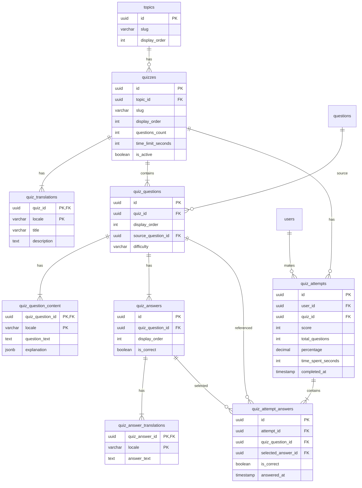

# Технічне дослідження: Квіз-система для сайту підготовки до співбесід

## 1. Огляд задачі

Квіз-система для інтерв'ю-платформи має три ключові компоненти:

1. **Квіз-контент**: питання з варіантами відповідей, прив'язані до існуючих topics
2. **Механіка гри**: вибір відповіді → зворотній зв'язок → перехід до наступного питання → фінальний результат
3. **Персоналізація**: збереження спроб, інтеграція з user_progress, leaderboard

Основна складність — інтеграція з існуючою архітектурою (questions, question_content) без дублювання даних і з підтримкою i18n.

---

## 2. UI/UX (Apple-style)

### 2.1. Дизайн-система

```css
:root {
  /* Light mode */
  --bg-primary: #ffffff;
  --bg-secondary: #f5f5f7;
  --bg-card: #ffffff;
  --text-primary: #1d1d1f;
  --text-secondary: #6e6e73;
  --accent: #007aff;
  --accent-hover: #0056b3;
  --success: #34c759;
  --error: #ff3b30;
  --border: #d2d2d7;
  
  /* Spacing scale */
  --space-xs: 4px;
  --space-sm: 8px;
  --space-md: 16px;
  --space-lg: 24px;
  --space-xl: 32px;
  --space-2xl: 48px;
  
  /* Typography */
  --font-sans: -apple-system, BlinkMacSystemFont, 'SF Pro Display', 'Helvetica Neue', sans-serif;
  --font-mono: 'SF Mono', 'Menlo', monospace;
  
  /* Radius */
  --radius-sm: 8px;
  --radius-md: 12px;
  --radius-lg: 16px;
  
  /* Transitions */
  --transition-fast: 150ms ease;
  --transition-base: 250ms ease;
  --transition-slow: 400ms ease;
}

[data-theme="dark"] {
  --bg-primary: #000000;
  --bg-secondary: #1c1c1e;
  --bg-card: #1c1c1e;
  --text-primary: #f5f5f7;
  --text-secondary: #8e8e93;
  --accent: #0a84ff;
  --accent-hover: #409cff;
  --success: #30d158;
  --error: #ff453a;
  --border: #38383a;
}
```

### 2.2. Квіз-картка: стани та переходи

**Стан 1: Очікування вибору**
- Питання відображається з повним текстом
- Варіанти — нейтральні картки з hover-ефектом (легке підсвічування border)
- Жодних тіней — тільки 1px border

**Стан 2: Вибрано (до підтвердження)**
- Обраний варіант — accent border (2px)
- Інші варіанти — залишаються доступними
- Цей стан можна пропустити — одразу переходити до результату після кліку

**Стан 3: Результат**
- Правильна відповідь: зелена обводка + checkmark
- Неправильна вибрана: червона обводка + cross
- Пояснення з'являється з fade-in (opacity transition 250ms)
- Кнопка "Далі" — accent колір, повна ширина

### 2.3. Прогрес-індикатор

```
[ 1 ]—[ 2 ]—[ 3 ]—[ 4 ]—[ 5 ]—[ 6 ]
  ●      ●      ●      ○      ○      ○
```

- Заповнені кола — пройдені питання
- Колір заповнення — залежить від правильності (зелений/червоний)
- Поточне питання — accent ring
- Лінія між колами — тонка (1px), колір border

Альтернатива — горизонтальний progress bar:
```
[████████████░░░░░░░░░░░░░░░░░░] 4/10
```
Простіше, але менш інформативно щодо правильності попередніх відповідей.

### 2.4. Фінальний екран

```
┌─────────────────────────────────┐
│                                 │
│           🎯 8/10               │
│                                 │
│     Чудовий результат!          │
│                                 │
│    ██████████████████░░ 80%     │
│                                 │
│  ┌─────────────────────────┐    │
│  │ Ваша позиція: #42       │    │
│  │ Серед 1,247 учасників   │    │
│  └─────────────────────────┘    │
│                                 │
│  [Переглянути відповіді]        │
│  [Спробувати ще раз]            │
│  [До теми]                      │
│                                 │
└─────────────────────────────────┘
```

### 2.5. Leaderboard UI

```
┌─────────────────────────────────────────┐
│  #   Користувач          Бал    Спроби  │
├─────────────────────────────────────────┤
│  🥇  Тарас К.            98%      3     │
│  🥈  Anna M.             95%      2     │
│  🥉  Петро В.            92%      5     │
│  4   Марія С.            88%      4     │
│  ─────────────────────────────────────  │
│ ▶42  Ви                  80%      1     │  ← підсвічено accent
│  ─────────────────────────────────────  │
│  43  Олексій Д.          79%      2     │
└─────────────────────────────────────────┘
```

- Перші три — з емодзі медалей
- Позиція користувача — завжди видима (sticky row)
- Accent background для рядка користувача
- Без тіней, чіткі горизонтальні розділювачі

---

## 3. Структура БД для квізів

### 3.1. Варіант A: Квізи як окрема сутність (рекомендовано)

Квіз — це набір питань з варіантами відповідей. Питання квізу можуть бути окремими від основних interview questions, або повторно використовувати існуючі.

```sql
-- Квізи (наприклад, "Python Fundamentals Quiz")
CREATE TABLE quizzes (
  id UUID PRIMARY KEY DEFAULT gen_random_uuid(),
  topic_id UUID REFERENCES topics(id) ON DELETE CASCADE,
  slug VARCHAR(100) NOT NULL,
  display_order INTEGER NOT NULL DEFAULT 0,
  questions_count INTEGER NOT NULL DEFAULT 10,
  time_limit_seconds INTEGER, -- NULL = без обмеження
  is_active BOOLEAN NOT NULL DEFAULT true,
  created_at TIMESTAMPTZ NOT NULL DEFAULT NOW(),
  updated_at TIMESTAMPTZ NOT NULL DEFAULT NOW(),
  UNIQUE(topic_id, slug)
);

-- Переклади квізів
CREATE TABLE quiz_translations (
  quiz_id UUID REFERENCES quizzes(id) ON DELETE CASCADE,
  locale VARCHAR(5) NOT NULL,
  title VARCHAR(200) NOT NULL,
  description TEXT,
  PRIMARY KEY (quiz_id, locale)
);

-- Питання квізу (структура, без тексту)
CREATE TABLE quiz_questions (
  id UUID PRIMARY KEY DEFAULT gen_random_uuid(),
  quiz_id UUID REFERENCES quizzes(id) ON DELETE CASCADE,
  display_order INTEGER NOT NULL,
  source_question_id UUID REFERENCES questions(id) ON DELETE SET NULL,
  -- Якщо source_question_id = NULL, це окреме квіз-питання
  -- Якщо вказано — можна показувати зв'язок з повним питанням
  difficulty VARCHAR(20) DEFAULT 'medium',
  created_at TIMESTAMPTZ NOT NULL DEFAULT NOW()
);

CREATE INDEX idx_quiz_questions_quiz ON quiz_questions(quiz_id, display_order);

-- Контент питань квізу (переклади)
CREATE TABLE quiz_question_content (
  quiz_question_id UUID REFERENCES quiz_questions(id) ON DELETE CASCADE,
  locale VARCHAR(5) NOT NULL,
  question_text TEXT NOT NULL, -- Може бути простим текстом або JSON
  explanation JSONB, -- Rich-text пояснення після відповіді
  PRIMARY KEY (quiz_question_id, locale)
);

-- Варіанти відповідей
CREATE TABLE quiz_answers (
  id UUID PRIMARY KEY DEFAULT gen_random_uuid(),
  quiz_question_id UUID REFERENCES quiz_questions(id) ON DELETE CASCADE,
  display_order INTEGER NOT NULL,
  is_correct BOOLEAN NOT NULL DEFAULT false
);

-- Переклади варіантів відповідей
CREATE TABLE quiz_answer_translations (
  quiz_answer_id UUID REFERENCES quiz_answers(id) ON DELETE CASCADE,
  locale VARCHAR(5) NOT NULL,
  answer_text TEXT NOT NULL,
  PRIMARY KEY (quiz_answer_id, locale)
);

CREATE INDEX idx_quiz_answers_question ON quiz_answers(quiz_question_id, display_order);
```

**Логіка:**

1. `quizzes` → один квіз на тему (можна кілька: "Python Basics", "Python Advanced")
2. `quiz_translations` → назва квізу трьома мовами
3. `quiz_questions` → порядок питань, зв'язок з основними questions (опціонально)
4. `quiz_question_content` → текст питання + пояснення (rich-text)
5. `quiz_answers` → варіанти (3-4 на питання), один правильний
6. `quiz_answer_translations` → текст варіантів трьома мовами

### 3.2. Варіант B: Квізи на основі існуючих questions

Якщо квіз-питання завжди базуються на існуючих interview questions:

```sql
CREATE TABLE quiz_questions (
  id UUID PRIMARY KEY DEFAULT gen_random_uuid(),
  quiz_id UUID REFERENCES quizzes(id) ON DELETE CASCADE,
  question_id UUID NOT NULL REFERENCES questions(id) ON DELETE CASCADE,
  display_order INTEGER NOT NULL,
  UNIQUE(quiz_id, question_id)
);

-- Варіанти генеруються або створюються вручну
CREATE TABLE quiz_answers (
  id UUID PRIMARY KEY DEFAULT gen_random_uuid(),
  quiz_question_id UUID REFERENCES quiz_questions(id) ON DELETE CASCADE,
  display_order INTEGER NOT NULL,
  is_correct BOOLEAN NOT NULL DEFAULT false
);

CREATE TABLE quiz_answer_translations (
  quiz_answer_id UUID REFERENCES quiz_answers(id) ON DELETE CASCADE,
  locale VARCHAR(5) NOT NULL,
  answer_text TEXT NOT NULL,
  PRIMARY KEY (quiz_answer_id, locale)
);

-- Пояснення беруться з question_content.answer
```

**Переваги B:** менше дублювання, автоматичний зв'язок з повним контентом.  
**Недоліки B:** менша гнучкість, не всі interview questions підходять для quiz формату.

### 3.3. Рекомендація

Варіант A — для MVP. Причини:

1. Не всі interview questions мають сенс як quiz (деякі вимагають розгорнутої відповіді)
2. Quiz questions потребують специфічного формулювання для multiple choice
3. `source_question_id` дозволяє опціонально пов'язати квіз-питання з повним контентом

---

## 4. Структура БД для результатів і leaderboard

### 4.1. Спроби проходження квізів

```sql
-- Кожна спроба проходження квізу
CREATE TABLE quiz_attempts (
  id UUID PRIMARY KEY DEFAULT gen_random_uuid(),
  user_id UUID NOT NULL REFERENCES users(id) ON DELETE CASCADE,
  quiz_id UUID NOT NULL REFERENCES quizzes(id) ON DELETE CASCADE,
  score INTEGER NOT NULL, -- кількість правильних
  total_questions INTEGER NOT NULL,
  percentage DECIMAL(5,2) GENERATED ALWAYS AS 
    (ROUND((score::DECIMAL / total_questions) * 100, 2)) STORED,
  time_spent_seconds INTEGER, -- скільки часу витрачено
  started_at TIMESTAMPTZ NOT NULL DEFAULT NOW(),
  completed_at TIMESTAMPTZ NOT NULL DEFAULT NOW()
);

CREATE INDEX idx_quiz_attempts_user ON quiz_attempts(user_id, completed_at DESC);
CREATE INDEX idx_quiz_attempts_quiz ON quiz_attempts(quiz_id, percentage DESC);
CREATE INDEX idx_quiz_attempts_leaderboard ON quiz_attempts(quiz_id, percentage DESC, completed_at ASC);

-- Відповіді в межах спроби
CREATE TABLE quiz_attempt_answers (
  id UUID PRIMARY KEY DEFAULT gen_random_uuid(),
  attempt_id UUID NOT NULL REFERENCES quiz_attempts(id) ON DELETE CASCADE,
  quiz_question_id UUID NOT NULL REFERENCES quiz_questions(id) ON DELETE CASCADE,
  selected_answer_id UUID REFERENCES quiz_answers(id) ON DELETE SET NULL,
  is_correct BOOLEAN NOT NULL,
  answered_at TIMESTAMPTZ NOT NULL DEFAULT NOW()
);

CREATE INDEX idx_attempt_answers_attempt ON quiz_attempt_answers(attempt_id);
```

### 4.2. Leaderboard

**Варіант A: Агрегований запит (без окремої таблиці)**

```sql
-- Найкращий результат кожного користувача для квізу
WITH best_scores AS (
  SELECT DISTINCT ON (user_id)
    user_id,
    score,
    percentage,
    completed_at,
    ROW_NUMBER() OVER (ORDER BY percentage DESC, completed_at ASC) as rank
  FROM quiz_attempts
  WHERE quiz_id = $1
  ORDER BY user_id, percentage DESC, completed_at ASC
)
SELECT 
  bs.rank,
  u.name,
  bs.percentage,
  (SELECT COUNT(*) FROM quiz_attempts WHERE user_id = bs.user_id AND quiz_id = $1) as attempts_count
FROM best_scores bs
JOIN users u ON u.id = bs.user_id
ORDER BY bs.rank
LIMIT 50;
```

**Варіант B: Materialized View (для швидкого читання)**

```sql
CREATE MATERIALIZED VIEW quiz_leaderboard AS
SELECT 
  qa.quiz_id,
  qa.user_id,
  MAX(qa.percentage) as best_percentage,
  COUNT(*) as attempts_count,
  MIN(qa.completed_at) FILTER (WHERE qa.percentage = MAX(qa.percentage)) as best_at
FROM quiz_attempts qa
GROUP BY qa.quiz_id, qa.user_id;

CREATE INDEX idx_leaderboard_quiz ON quiz_leaderboard(quiz_id, best_percentage DESC);

-- Оновлення після кожної спроби (або за розкладом)
REFRESH MATERIALIZED VIEW CONCURRENTLY quiz_leaderboard;
```

**Рекомендація:** Варіант A для MVP (до 10K спроб на квіз). Варіант B — коли запити стануть повільними (> 100ms).

### 4.3. Інтеграція з user_progress

Після успішного проходження квізу (наприклад, >= 70%) оновлюємо прогрес для пов'язаних питань:

```sql
-- Server action: після завершення квізу
CREATE OR REPLACE FUNCTION update_progress_from_quiz(
  p_user_id UUID,
  p_attempt_id UUID,
  p_threshold_percent DECIMAL DEFAULT 70
)
RETURNS void AS $$
DECLARE
  v_quiz_id UUID;
  v_percentage DECIMAL;
BEGIN
  SELECT quiz_id, percentage INTO v_quiz_id, v_percentage
  FROM quiz_attempts WHERE id = p_attempt_id;
  
  IF v_percentage >= p_threshold_percent THEN
    -- Оновлюємо прогрес для всіх питань квізу, які мають source_question_id
    INSERT INTO user_progress (user_id, question_id, status, times_viewed, last_viewed_at)
    SELECT 
      p_user_id,
      qq.source_question_id,
      CASE WHEN v_percentage >= 90 THEN 'learned' ELSE 'learning' END,
      1,
      NOW()
    FROM quiz_questions qq
    WHERE qq.quiz_id = v_quiz_id
      AND qq.source_question_id IS NOT NULL
    ON CONFLICT (user_id, question_id) DO UPDATE
      SET status = EXCLUDED.status,
          times_viewed = user_progress.times_viewed + 1,
          last_viewed_at = NOW();
  END IF;
END;
$$ LANGUAGE plpgsql;
```

---

## 5. Архітектура Next.js

### 5.1. Розподіл Server/Client Components

```
app/
├── [locale]/
│   └── quiz/
│       └── [slug]/
│           ├── page.tsx           ← Server Component (SSR)
│           ├── loading.tsx        ← Server Component (loading UI)
│           └── _components/
│               ├── QuizContainer.tsx    ← Client Component (state)
│               ├── QuizQuestion.tsx     ← Client Component (interactions)
│               ├── QuizProgress.tsx     ← Client Component (animations)
│               ├── QuizResult.tsx       ← Client Component
│               └── Leaderboard.tsx      ← Server Component (static data)
```

### 5.2. Server Component: page.tsx

```tsx
// app/[locale]/quiz/[slug]/page.tsx
import { Suspense } from 'react';
import { getQuizWithQuestions, getQuizLeaderboard, getUserBestAttempt } from '@/db/queries';
import { QuizContainer } from './_components/QuizContainer';
import { Leaderboard } from './_components/Leaderboard';
import { getCurrentUser } from '@/lib/auth';

interface PageProps {
  params: { locale: string; slug: string };
}

export default async function QuizPage({ params }: PageProps) {
  const { locale, slug } = params;
  const user = await getCurrentUser();
  
  // Паралельні запити
  const [quiz, leaderboard, userBest] = await Promise.all([
    getQuizWithQuestions(slug, locale),
    getQuizLeaderboard(slug, 10),
    user ? getUserBestAttempt(user.id, slug) : null,
  ]);
  
  if (!quiz) {
    notFound();
  }
  
  return (
    <main className="quiz-page">
      <header className="quiz-header">
        <h1>{quiz.title}</h1>
        <p>{quiz.description}</p>
      </header>
      
      <QuizContainer 
        quiz={quiz}
        questions={quiz.questions}
        userId={user?.id}
        previousBest={userBest?.percentage}
      />
      
      <Suspense fallback={<LeaderboardSkeleton />}>
        <Leaderboard 
          entries={leaderboard}
          currentUserId={user?.id}
        />
      </Suspense>
    </main>
  );
}
```

### 5.3. Client Component: QuizContainer

```tsx
// app/[locale]/quiz/[slug]/_components/QuizContainer.tsx
'use client';

import { useReducer, useCallback, useTransition } from 'react';
import { QuizQuestion } from './QuizQuestion';
import { QuizProgress } from './QuizProgress';
import { QuizResult } from './QuizResult';
import { submitQuizAttempt } from '@/actions/quiz';
import type { Quiz, QuizQuestionWithAnswers } from '@/types/quiz';

type QuizState = {
  status: 'idle' | 'answering' | 'revealed' | 'completed';
  currentIndex: number;
  answers: { questionId: string; answerId: string; isCorrect: boolean }[];
  score: number;
  attemptId: string | null;
};

type QuizAction =
  | { type: 'SELECT_ANSWER'; questionId: string; answerId: string; isCorrect: boolean }
  | { type: 'NEXT_QUESTION' }
  | { type: 'COMPLETE'; attemptId: string }
  | { type: 'RESTART' };

function quizReducer(state: QuizState, action: QuizAction): QuizState {
  switch (action.type) {
    case 'SELECT_ANSWER':
      return {
        ...state,
        status: 'revealed',
        answers: [...state.answers, {
          questionId: action.questionId,
          answerId: action.answerId,
          isCorrect: action.isCorrect,
        }],
        score: action.isCorrect ? state.score + 1 : state.score,
      };
    case 'NEXT_QUESTION':
      return {
        ...state,
        status: 'answering',
        currentIndex: state.currentIndex + 1,
      };
    case 'COMPLETE':
      return {
        ...state,
        status: 'completed',
        attemptId: action.attemptId,
      };
    case 'RESTART':
      return initialState;
    default:
      return state;
  }
}

const initialState: QuizState = {
  status: 'answering',
  currentIndex: 0,
  answers: [],
  score: 0,
  attemptId: null,
};

interface Props {
  quiz: Quiz;
  questions: QuizQuestionWithAnswers[];
  userId?: string;
  previousBest?: number;
}

export function QuizContainer({ quiz, questions, userId, previousBest }: Props) {
  const [state, dispatch] = useReducer(quizReducer, initialState);
  const [isPending, startTransition] = useTransition();
  
  const currentQuestion = questions[state.currentIndex];
  const isLastQuestion = state.currentIndex === questions.length - 1;
  
  const handleAnswer = useCallback((answerId: string) => {
    const answer = currentQuestion.answers.find(a => a.id === answerId);
    if (!answer || state.status !== 'answering') return;
    
    dispatch({
      type: 'SELECT_ANSWER',
      questionId: currentQuestion.id,
      answerId,
      isCorrect: answer.isCorrect,
    });
  }, [currentQuestion, state.status]);
  
  const handleNext = useCallback(() => {
    if (isLastQuestion) {
      // Відправляємо результат на сервер
      startTransition(async () => {
        const result = await submitQuizAttempt({
          userId,
          quizId: quiz.id,
          answers: state.answers,
          score: state.score,
          totalQuestions: questions.length,
        });
        
        if (result.success) {
          dispatch({ type: 'COMPLETE', attemptId: result.attemptId });
        }
      });
    } else {
      dispatch({ type: 'NEXT_QUESTION' });
    }
  }, [isLastQuestion, quiz.id, state.answers, state.score, questions.length, userId]);
  
  if (state.status === 'completed') {
    return (
      <QuizResult
        score={state.score}
        total={questions.length}
        previousBest={previousBest}
        attemptId={state.attemptId}
        onRestart={() => dispatch({ type: 'RESTART' })}
      />
    );
  }
  
  return (
    <div className="quiz-container">
      <QuizProgress
        current={state.currentIndex + 1}
        total={questions.length}
        answers={state.answers}
      />
      
      <QuizQuestion
        question={currentQuestion}
        status={state.status}
        selectedAnswerId={state.answers[state.currentIndex]?.answerId}
        onAnswer={handleAnswer}
        onNext={handleNext}
        isLoading={isPending}
      />
    </div>
  );
}
```

### 5.4. Server Action: submitQuizAttempt

```tsx
// actions/quiz.ts
'use server';

import { db } from '@/db/connection';
import { quizAttempts, quizAttemptAnswers } from '@/db/schema';
import { revalidatePath } from 'next/cache';

interface SubmitQuizAttemptInput {
  userId?: string;
  quizId: string;
  answers: { questionId: string; answerId: string; isCorrect: boolean }[];
  score: number;
  totalQuestions: number;
}

export async function submitQuizAttempt(input: SubmitQuizAttemptInput) {
  const { userId, quizId, answers, score, totalQuestions } = input;
  
  // Гостьові результати не зберігаємо
  if (!userId) {
    return { success: true, attemptId: 'guest', saved: false };
  }
  
  try {
    const attemptId = crypto.randomUUID();
    
    // Транзакція: зберігаємо спробу + всі відповіді
    await db.transaction(async (tx) => {
      await tx.insert(quizAttempts).values({
        id: attemptId,
        userId,
        quizId,
        score,
        totalQuestions,
        completedAt: new Date(),
      });
      
      await tx.insert(quizAttemptAnswers).values(
        answers.map((a, idx) => ({
          id: crypto.randomUUID(),
          attemptId,
          quizQuestionId: a.questionId,
          selectedAnswerId: a.answerId,
          isCorrect: a.isCorrect,
          answeredAt: new Date(),
        }))
      );
    });
    
    // Ревалідація сторінки квізу (оновлення leaderboard)
    revalidatePath(`/quiz/${quizId}`);
    
    return { success: true, attemptId, saved: true };
  } catch (error) {
    console.error('Failed to save quiz attempt:', error);
    return { success: false, error: 'Failed to save result' };
  }
}
```

### 5.5. Чому такий поділ

**Server Components отримують:**
- Статичні дані квізу (питання, переклади) — кешуються
- Leaderboard — може бути ISR з revalidate
- Попередній результат користувача — персоналізовані дані

**Client Components обробляють:**
- Стан квізу (поточне питання, відповіді, score)
- Анімації (переходи між питаннями, reveal відповіді)
- Відправку результатів (server action)

Принцип: дані течуть зверху (Server → Client), події течуть знизу (Client → Server через actions).

---

## 6. Поради та best practices

### 6.1. Структура компонентів

```
QuizContainer          — state management (useReducer)
├── QuizProgress       — відображення прогресу (pure)
├── QuizQuestion       — одне питання + варіанти
│   ├── QuestionText   — рендер тексту питання
│   └── AnswerOption   — один варіант відповіді (button)
├── QuizExplanation    — пояснення після відповіді
└── QuizResult         — фінальний екран
```

### 6.2. Запобігання подвійним клікам

```tsx
// В QuizQuestion
const [isLocked, setIsLocked] = useState(false);

const handleClick = (answerId: string) => {
  if (isLocked || status !== 'answering') return;
  setIsLocked(true);
  onAnswer(answerId);
};

// isLocked скидається при зміні питання через useEffect
useEffect(() => {
  setIsLocked(false);
}, [question.id]);
```

### 6.3. Тестування компонента

```tsx
// __tests__/QuizQuestion.test.tsx
import { render, screen, fireEvent } from '@testing-library/react';
import { QuizQuestion } from '../QuizQuestion';

const mockQuestion = {
  id: 'q1',
  text: 'What is 2 + 2?',
  answers: [
    { id: 'a1', text: '3', isCorrect: false },
    { id: 'a2', text: '4', isCorrect: true },
    { id: 'a3', text: '5', isCorrect: false },
  ],
};

test('calls onAnswer with correct answerId', () => {
  const onAnswer = jest.fn();
  render(
    <QuizQuestion
      question={mockQuestion}
      status="answering"
      onAnswer={onAnswer}
      onNext={jest.fn()}
    />
  );
  
  fireEvent.click(screen.getByText('4'));
  expect(onAnswer).toHaveBeenCalledWith('a2');
});

test('disables answers after selection', () => {
  render(
    <QuizQuestion
      question={mockQuestion}
      status="revealed"
      selectedAnswerId="a1"
      onAnswer={jest.fn()}
      onNext={jest.fn()}
    />
  );
  
  const buttons = screen.getAllByRole('button');
  buttons.forEach(btn => {
    if (btn.textContent !== 'Далі') {
      expect(btn).toHaveAttribute('aria-disabled', 'true');
    }
  });
});
```

### 6.4. Підтримка тем (light/dark)

```tsx
// components/ThemeToggle.tsx
'use client';

import { useTheme } from 'next-themes';

export function ThemeToggle() {
  const { theme, setTheme } = useTheme();
  
  return (
    <button
      onClick={() => setTheme(theme === 'dark' ? 'light' : 'dark')}
      className="theme-toggle"
      aria-label={`Switch to ${theme === 'dark' ? 'light' : 'dark'} mode`}
    >
      {theme === 'dark' ? '☀️' : '🌙'}
    </button>
  );
}

// app/layout.tsx
import { ThemeProvider } from 'next-themes';

export default function RootLayout({ children }) {
  return (
    <html suppressHydrationWarning>
      <body>
        <ThemeProvider attribute="data-theme" defaultTheme="system">
          {children}
        </ThemeProvider>
      </body>
    </html>
  );
}
```

---

## 7. Anti-Cheating система

### 7.1. Рівні захисту

| Рівень | Метод | Складність обходу | Вплив на UX |
|--------|-------|-------------------|-------------|
| 1 | Заборона копіювання | Низька | Мінімальний |
| 2 | Виявлення зміни вкладки | Низька | Середній |
| 3 | Рандомізація питань/відповідей | Висока | Нульовий |
| 4 | Часові обмеження | Середня | Середній |
| 5 | Серверна валідація | Висока | Нульовий |

### 7.2. Client-side захист

#### 7.2.1. Заборона копіювання тексту

```tsx
// hooks/useAntiCheat.ts
'use client';

import { useEffect, useCallback, useState } from 'react';
import { toast } from 'sonner'; // або інша toast-бібліотека

interface AntiCheatConfig {
  preventCopy?: boolean;
  preventContextMenu?: boolean;
  detectTabSwitch?: boolean;
  detectDevTools?: boolean;
  onViolation?: (type: string) => void;
}

export function useAntiCheat(config: AntiCheatConfig = {}) {
  const {
    preventCopy = true,
    preventContextMenu = true,
    detectTabSwitch = true,
    detectDevTools = false,
    onViolation,
  } = config;

  const [violations, setViolations] = useState<string[]>([]);
  const [isTabActive, setIsTabActive] = useState(true);

  const handleViolation = useCallback((type: string) => {
    setViolations(prev => [...prev, type]);
    onViolation?.(type);
  }, [onViolation]);

  useEffect(() => {
    // Заборона копіювання
    const handleCopy = (e: ClipboardEvent) => {
      if (!preventCopy) return;
      e.preventDefault();
      toast.warning('Копіювання вимкнено під час проходження квізу', {
        duration: 3000,
      });
      handleViolation('copy_attempt');
    };

    // Заборона виділення тексту (опціонально)
    const handleSelectStart = (e: Event) => {
      if (!preventCopy) return;
      // Дозволяємо виділення в input/textarea
      const target = e.target as HTMLElement;
      if (target.tagName === 'INPUT' || target.tagName === 'TEXTAREA') return;
      e.preventDefault();
    };

    // Заборона контекстного меню
    const handleContextMenu = (e: MouseEvent) => {
      if (!preventContextMenu) return;
      e.preventDefault();
      toast.warning('Контекстне меню вимкнено', { duration: 2000 });
      handleViolation('context_menu_attempt');
    };

    // Виявлення зміни вкладки
    const handleVisibilityChange = () => {
      if (!detectTabSwitch) return;
      if (document.hidden) {
        setIsTabActive(false);
        handleViolation('tab_switch');
        toast.error('Ви залишили сторінку квізу', {
          description: 'Це буде зафіксовано в результатах',
          duration: 5000,
        });
      } else {
        setIsTabActive(true);
      }
    };

    // Виявлення втрати фокусу вікна
    const handleBlur = () => {
      if (!detectTabSwitch) return;
      handleViolation('window_blur');
    };

    document.addEventListener('copy', handleCopy);
    document.addEventListener('selectstart', handleSelectStart);
    document.addEventListener('contextmenu', handleContextMenu);
    document.addEventListener('visibilitychange', handleVisibilityChange);
    window.addEventListener('blur', handleBlur);

    return () => {
      document.removeEventListener('copy', handleCopy);
      document.removeEventListener('selectstart', handleSelectStart);
      document.removeEventListener('contextmenu', handleContextMenu);
      document.removeEventListener('visibilitychange', handleVisibilityChange);
      window.removeEventListener('blur', handleBlur);
    };
  }, [preventCopy, preventContextMenu, detectTabSwitch, handleViolation]);

  // Виявлення DevTools (експериментально)
  useEffect(() => {
    if (!detectDevTools) return;

    const threshold = 160;
    const checkDevTools = () => {
      const widthThreshold = window.outerWidth - window.innerWidth > threshold;
      const heightThreshold = window.outerHeight - window.innerHeight > threshold;
      
      if (widthThreshold || heightThreshold) {
        handleViolation('devtools_open');
        toast.error('Інструменти розробника виявлено', { duration: 3000 });
      }
    };

    const interval = setInterval(checkDevTools, 1000);
    return () => clearInterval(interval);
  }, [detectDevTools, handleViolation]);

  return {
    violations,
    violationCount: violations.length,
    isTabActive,
  };
}
```

#### 7.2.2. CSS-захист від виділення

```css
/* components/QuizQuestion.module.css */
.quizContent {
  /* Забороняємо виділення тексту */
  user-select: none;
  -webkit-user-select: none;
  -moz-user-select: none;
  -ms-user-select: none;
  
  /* Забороняємо drag */
  -webkit-user-drag: none;
  user-drag: none;
}

/* Дозволяємо виділення в полях вводу */
.quizContent input,
.quizContent textarea {
  user-select: text;
  -webkit-user-select: text;
}

/* Блокуємо друк (Ctrl+P) */
@media print {
  .quizContent {
    display: none !important;
  }
  
  body::after {
    content: 'Друк квізу заборонено';
    display: block;
    text-align: center;
    padding: 48px;
    font-size: 24px;
  }
}
```

#### 7.2.3. Інтеграція в QuizContainer

```tsx
// components/QuizContainer.tsx
'use client';

import { useAntiCheat } from '@/hooks/useAntiCheat';

export function QuizContainer({ quiz, questions, userId }: Props) {
  const { violations, isTabActive } = useAntiCheat({
    preventCopy: true,
    preventContextMenu: true,
    detectTabSwitch: true,
    detectDevTools: false, // Може дратувати розробників
    onViolation: (type) => {
      // Логуємо для аналітики
      console.log(`Anti-cheat violation: ${type}`);
    },
  });

  // Передаємо violations в результати
  const handleComplete = async () => {
    await submitQuizAttempt({
      // ... інші поля
      metadata: {
        violations,
        tabSwitchCount: violations.filter(v => v === 'tab_switch').length,
      },
    });
  };

  return (
    <div className={styles.quizContent}>
      {!isTabActive && (
        <div className={styles.tabWarning}>
          ⚠️ Поверніться до квізу
        </div>
      )}
      {/* ... решта компонента */}
    </div>
  );
}
```

### 7.3. Server-side захист

#### 7.3.1. Рандомізація питань і відповідей

```tsx
// db/queries.ts
import { sql } from 'drizzle-orm';

export async function getQuizQuestionsRandomized(
  quizId: string, 
  locale: string,
  seed?: number // Дозволяє відтворити порядок для тієї ж спроби
) {
  // Seed на основі attemptId для консистентності в межах спроби
  const randomSeed = seed ?? Math.floor(Math.random() * 1000000);
  
  const questions = await db.query.quizQuestions.findMany({
    where: eq(quizQuestions.quizId, quizId),
    with: {
      content: {
        where: eq(quizQuestionContent.locale, locale),
      },
      answers: {
        with: {
          translations: {
            where: eq(quizAnswerTranslations.locale, locale),
          },
        },
      },
    },
  });

  // Рандомізація з seed (Fisher-Yates)
  const seededRandom = (seed: number) => {
    const x = Math.sin(seed++) * 10000;
    return x - Math.floor(x);
  };

  let currentSeed = randomSeed;
  
  // Перемішуємо питання
  const shuffledQuestions = [...questions];
  for (let i = shuffledQuestions.length - 1; i > 0; i--) {
    const j = Math.floor(seededRandom(currentSeed++) * (i + 1));
    [shuffledQuestions[i], shuffledQuestions[j]] = [shuffledQuestions[j], shuffledQuestions[i]];
  }

  // Перемішуємо відповіді в кожному питанні
  return shuffledQuestions.map(q => ({
    ...q,
    answers: shuffleWithSeed(q.answers, currentSeed++),
  }));
}

function shuffleWithSeed<T>(array: T[], seed: number): T[] {
  const result = [...array];
  const seededRandom = (s: number) => {
    const x = Math.sin(s) * 10000;
    return x - Math.floor(x);
  };
  
  for (let i = result.length - 1; i > 0; i--) {
    const j = Math.floor(seededRandom(seed + i) * (i + 1));
    [result[i], result[j]] = [result[j], result[i]];
  }
  return result;
}
```

#### 7.3.2. Часові обмеження та валідація

```tsx
// actions/quiz.ts
'use server';

interface SubmitQuizAttemptInput {
  attemptId: string;
  userId: string;
  quizId: string;
  answers: { questionId: string; answerId: string; timestamp: number }[];
  startedAt: number;
  completedAt: number;
  metadata?: {
    violations?: string[];
    tabSwitchCount?: number;
  };
}

export async function submitQuizAttempt(input: SubmitQuizAttemptInput) {
  const { attemptId, userId, quizId, answers, startedAt, completedAt, metadata } = input;

  // 1. Валідація часу
  const quiz = await db.query.quizzes.findFirst({
    where: eq(quizzes.id, quizId),
  });

  if (!quiz) {
    return { success: false, error: 'Quiz not found' };
  }

  const totalTime = completedAt - startedAt;
  const minTimePerQuestion = 3000; // 3 секунди мінімум на питання
  const expectedMinTime = answers.length * minTimePerQuestion;

  // Підозріло швидке проходження
  const isSuspiciouslyFast = totalTime < expectedMinTime;

  // Перевищення ліміту часу (якщо є)
  const isOverTime = quiz.timeLimitSeconds 
    ? totalTime > quiz.timeLimitSeconds * 1000 + 30000 // +30s grace period
    : false;

  // 2. Валідація відповідей
  const correctAnswers = await db.query.quizAnswers.findMany({
    where: and(
      inArray(quizAnswers.quizQuestionId, answers.map(a => a.questionId)),
      eq(quizAnswers.isCorrect, true),
    ),
  });

  const correctAnswerMap = new Map(
    correctAnswers.map(a => [a.quizQuestionId, a.id])
  );

  let score = 0;
  const validatedAnswers = answers.map(a => {
    const isCorrect = correctAnswerMap.get(a.questionId) === a.answerId;
    if (isCorrect) score++;
    return { ...a, isCorrect };
  });

  // 3. Обчислення integrity score
  const integrityScore = calculateIntegrityScore({
    isSuspiciouslyFast,
    isOverTime,
    tabSwitchCount: metadata?.tabSwitchCount ?? 0,
    violationCount: metadata?.violations?.length ?? 0,
  });

  // 4. Зберігаємо результат
  await db.transaction(async (tx) => {
    await tx.insert(quizAttempts).values({
      id: attemptId,
      userId,
      quizId,
      score,
      totalQuestions: answers.length,
      percentage: (score / answers.length) * 100,
      timeSpentSeconds: Math.round(totalTime / 1000),
      integrityScore, // Нове поле
      metadata: {
        violations: metadata?.violations,
        isSuspiciouslyFast,
        isOverTime,
      },
      completedAt: new Date(),
    });

    await tx.insert(quizAttemptAnswers).values(
      validatedAnswers.map(a => ({
        id: crypto.randomUUID(),
        attemptId,
        quizQuestionId: a.questionId,
        selectedAnswerId: a.answerId,
        isCorrect: a.isCorrect,
        answeredAt: new Date(a.timestamp),
      }))
    );
  });

  return { 
    success: true, 
    attemptId,
    integrityScore,
    flags: {
      isSuspiciouslyFast,
      isOverTime,
    },
  };
}

function calculateIntegrityScore(params: {
  isSuspiciouslyFast: boolean;
  isOverTime: boolean;
  tabSwitchCount: number;
  violationCount: number;
}): number {
  let score = 100;
  
  if (params.isSuspiciouslyFast) score -= 30;
  if (params.isOverTime) score -= 10;
  score -= params.tabSwitchCount * 5;
  score -= params.violationCount * 2;
  
  return Math.max(0, score);
}
```

#### 7.3.3. Оновлення схеми БД

```sql
-- Додаємо поля для anti-cheat
ALTER TABLE quiz_attempts 
ADD COLUMN integrity_score INTEGER DEFAULT 100,
ADD COLUMN metadata JSONB DEFAULT '{}';

-- Індекс для фільтрації підозрілих спроб
CREATE INDEX idx_quiz_attempts_integrity 
ON quiz_attempts(quiz_id, integrity_score DESC);
```

```typescript
// db/schema.ts - оновлення
export const quizAttempts = pgTable('quiz_attempts', {
  // ... існуючі поля
  integrityScore: integer('integrity_score').default(100),
  metadata: jsonb('metadata').$type<{
    violations?: string[];
    isSuspiciouslyFast?: boolean;
    isOverTime?: boolean;
  }>().default({}),
});
```

### 7.4. Leaderboard з урахуванням integrity

```tsx
// db/queries.ts
export async function getQuizLeaderboard(quizId: string, limit: number = 50) {
  return db.execute(sql`
    WITH best_scores AS (
      SELECT DISTINCT ON (user_id)
        user_id,
        percentage,
        integrity_score,
        completed_at
      FROM quiz_attempts
      WHERE quiz_id = ${quizId}
        AND integrity_score >= 70  -- Фільтруємо підозрілі спроби
      ORDER BY user_id, percentage DESC, completed_at ASC
    )
    SELECT 
      ROW_NUMBER() OVER (ORDER BY percentage DESC, completed_at ASC) as rank,
      u.name,
      bs.percentage,
      bs.integrity_score
    FROM best_scores bs
    JOIN users u ON u.id = bs.user_id
    ORDER BY rank
    LIMIT ${limit}
  `);
}
```

### 7.5. Обмеження та застереження

**Що НЕ можна надійно захистити на клієнті:**

1. **Screenshot** — OS-level, неможливо заблокувати
2. **Зовнішній запис екрану** — OBS, телефон
3. **Другий пристрій** — пошук відповідей на іншому девайсі
4. **Розширення браузера** — можуть обійти JS-захист

**Рекомендації:**

1. Не покладатись тільки на client-side захист — він легко обходиться
2. Фокус на server-side валідацію та integrity scoring
3. Для серйозних іспитів — proctoring (камера, AI-моніторинг)
4. Для навчальних квізів — м'який підхід (попередження замість блокування)

### 7.6. Toast повідомлення

```tsx
// Приклади повідомлень для різних порушень
const VIOLATION_MESSAGES = {
  copy_attempt: {
    title: 'Копіювання заборонено',
    description: 'Під час квізу не можна копіювати текст',
    variant: 'warning',
  },
  context_menu_attempt: {
    title: 'Контекстне меню вимкнено',
    description: undefined,
    variant: 'warning',
  },
  tab_switch: {
    title: 'Ви залишили сторінку',
    description: 'Це буде враховано при оцінюванні',
    variant: 'destructive',
  },
  devtools_open: {
    title: 'Виявлено інструменти розробника',
    description: 'Будь ласка, закрийте DevTools',
    variant: 'destructive',
  },
} as const;
```

---

## 8. Приклади компонентів

### 8.1. QuizQuestion з mock-даними

```tsx
// components/QuizQuestion.tsx
'use client';

import { useState, useEffect, useCallback } from 'react';
import { CheckCircle, XCircle } from 'lucide-react';
import { cn } from '@/lib/utils';
import styles from './QuizQuestion.module.css';

interface Answer {
  id: string;
  text: string;
  isCorrect: boolean;
}

interface Question {
  id: string;
  text: string;
  number: string;
  answers: Answer[];
  explanation?: {
    blocks: Array<{ type: string; children: Array<{ text: string }> }>;
  };
}

interface Props {
  question: Question;
  status: 'answering' | 'revealed';
  selectedAnswerId?: string;
  onAnswer: (answerId: string) => void;
  onNext: () => void;
  isLoading?: boolean;
}

export function QuizQuestion({
  question,
  status,
  selectedAnswerId,
  onAnswer,
  onNext,
  isLoading,
}: Props) {
  const [isLocked, setIsLocked] = useState(false);
  
  // Скидаємо lock при новому питанні
  useEffect(() => {
    setIsLocked(false);
  }, [question.id]);
  
  const handleAnswerClick = useCallback((answerId: string) => {
    if (isLocked || status !== 'answering') return;
    setIsLocked(true);
    onAnswer(answerId);
  }, [isLocked, status, onAnswer]);
  
  const getAnswerState = (answer: Answer) => {
    if (status !== 'revealed') return 'default';
    if (answer.id === selectedAnswerId) {
      return answer.isCorrect ? 'correct' : 'incorrect';
    }
    if (answer.isCorrect) return 'correct-hint';
    return 'default';
  };
  
  return (
    <article className={styles.questionCard}>
      <header className={styles.questionHeader}>
        <span className={styles.questionNumber}>{question.number}</span>
        <h2 className={styles.questionText}>{question.text}</h2>
      </header>
      
      <div className={styles.answersGrid} role="radiogroup">
        {question.answers.map((answer) => {
          const state = getAnswerState(answer);
          
          return (
            <button
              key={answer.id}
              onClick={() => handleAnswerClick(answer.id)}
              disabled={status === 'revealed'}
              aria-disabled={status === 'revealed'}
              className={cn(styles.answerOption, styles[state])}
              role="radio"
              aria-checked={answer.id === selectedAnswerId}
            >
              <span className={styles.answerIndicator}>
                {state === 'correct' && <CheckCircle size={20} />}
                {state === 'incorrect' && <XCircle size={20} />}
                {state === 'default' && <span className={styles.radioCircle} />}
                {state === 'correct-hint' && <CheckCircle size={20} />}
              </span>
              <span className={styles.answerText}>{answer.text}</span>
            </button>
          );
        })}
      </div>
      
      {status === 'revealed' && question.explanation && (
        <div className={styles.explanation} aria-live="polite">
          <div className={styles.explanationHeader}>
            <CheckCircle size={16} className={styles.explanationIcon} />
            <span>Результат</span>
          </div>
          <p className={styles.explanationText}>
            {question.explanation.blocks[0]?.children[0]?.text}
          </p>
        </div>
      )}
      
      {status === 'revealed' && (
        <button
          onClick={onNext}
          disabled={isLoading}
          className={styles.nextButton}
        >
          {isLoading ? 'Зберігаємо...' : 'Далі'}
        </button>
      )}
    </article>
  );
}
```

### 8.2. CSS Module (Apple-style)

```css
/* components/QuizQuestion.module.css */
.questionCard {
  max-width: 640px;
  margin: 0 auto;
  padding: var(--space-xl);
}

.questionHeader {
  margin-bottom: var(--space-lg);
}

.questionNumber {
  display: block;
  font-size: 14px;
  color: var(--text-secondary);
  margin-bottom: var(--space-xs);
}

.questionText {
  font-size: 20px;
  font-weight: 600;
  color: var(--text-primary);
  line-height: 1.4;
}

.answersGrid {
  display: flex;
  flex-direction: column;
  gap: var(--space-sm);
}

.answerOption {
  display: flex;
  align-items: flex-start;
  gap: var(--space-md);
  padding: var(--space-md);
  background: var(--bg-card);
  border: 1px solid var(--border);
  border-radius: var(--radius-md);
  text-align: left;
  cursor: pointer;
  transition: 
    border-color var(--transition-fast),
    background-color var(--transition-fast);
}

.answerOption:hover:not([disabled]) {
  border-color: var(--accent);
}

.answerOption:focus-visible {
  outline: 2px solid var(--accent);
  outline-offset: 2px;
}

.answerOption[disabled] {
  cursor: default;
}

.answerIndicator {
  flex-shrink: 0;
  width: 20px;
  height: 20px;
  display: flex;
  align-items: center;
  justify-content: center;
  color: var(--text-secondary);
}

.radioCircle {
  width: 18px;
  height: 18px;
  border: 2px solid var(--border);
  border-radius: 50%;
}

.answerText {
  font-size: 16px;
  color: var(--text-primary);
  line-height: 1.4;
}

/* States */
.correct {
  border-color: var(--success);
  background: color-mix(in srgb, var(--success) 8%, transparent);
}

.correct .answerIndicator {
  color: var(--success);
}

.incorrect {
  border-color: var(--error);
  background: color-mix(in srgb, var(--error) 8%, transparent);
}

.incorrect .answerIndicator {
  color: var(--error);
}

.correct-hint {
  border-color: var(--success);
}

.correct-hint .answerIndicator {
  color: var(--success);
  opacity: 0.5;
}

/* Explanation */
.explanation {
  margin-top: var(--space-lg);
  padding: var(--space-md);
  background: color-mix(in srgb, var(--success) 8%, transparent);
  border-radius: var(--radius-md);
  animation: fadeIn var(--transition-base);
}

.explanationHeader {
  display: flex;
  align-items: center;
  gap: var(--space-sm);
  font-weight: 600;
  color: var(--success);
  margin-bottom: var(--space-sm);
}

.explanationIcon {
  flex-shrink: 0;
}

.explanationText {
  font-size: 15px;
  color: var(--text-primary);
  line-height: 1.5;
}

/* Next button */
.nextButton {
  width: 100%;
  margin-top: var(--space-lg);
  padding: var(--space-md);
  background: var(--accent);
  color: white;
  font-size: 16px;
  font-weight: 600;
  border: none;
  border-radius: var(--radius-md);
  cursor: pointer;
  transition: background-color var(--transition-fast);
}

.nextButton:hover:not([disabled]) {
  background: var(--accent-hover);
}

.nextButton:disabled {
  opacity: 0.6;
  cursor: not-allowed;
}

@keyframes fadeIn {
  from { opacity: 0; transform: translateY(-8px); }
  to { opacity: 1; transform: translateY(0); }
}
```

### 8.3. Mock дані для тестування

```tsx
// __mocks__/quizData.ts
export const mockQuiz = {
  id: 'quiz-python-basics',
  slug: 'python-basics',
  title: 'Основи Python',
  description: 'Перевірте свої знання базових концепцій Python',
  questionsCount: 10,
};

export const mockQuestions = [
  {
    id: 'q1',
    number: '3.8.',
    text: 'Що таке мінімальний розріз у контексті алгоритмів мережевих потоків?',
    answers: [
      { id: 'a1', text: 'Найкоротший шлях від джерела до стоку в розгалуженому графі', isCorrect: false },
      { id: 'a2', text: 'Множина ребер з мінімальною сумарною пропускною здатністю, видалення яких відділяє стік від джерела', isCorrect: true },
      { id: 'a3', text: 'Множина вершин в розгалуженому графу з максимальною сумарною пропускною здатністю', isCorrect: false },
      { id: 'a4', text: 'Найдовший шлях від джерела до стоку в розгалуженому графі', isCorrect: false },
    ],
    explanation: {
      blocks: [
        {
          type: 'paragraph',
          children: [
            { text: 'Правильно! Мінімальний розріз — це множина ребер з мінімальною сумарною пропускною здатністю, видалення яких розділяє граф на дві частини: одна містить джерело, а інша — сток.' },
          ],
        },
      ],
    },
  },
  // Інші питання...
];
```

---

## 9. Підсумкова рекомендація

### 9.1. Для MVP

1. **БД:** Варіант A (окремі квіз-таблиці) — гнучкість важливіша за економію
2. **Leaderboard:** Агрегований запит (без materialized view)
3. **Архітектура:** Server Components для даних, Client для інтерактиву
4. **UI:** Tailwind + CSS Modules для Apple-style

### 9.2. Пріоритет реалізації

1. Схема БД + міграції
2. QuizQuestion компонент (stateless)
3. QuizContainer (state management)
4. Server action для збереження
5. Leaderboard
6. Інтеграція з user_progress

### 9.3. Технічні рішення

| Рішення | Вибір | Причина |
|---------|-------|---------|
| State management | useReducer | Передбачувані переходи станів |
| Анімації | CSS transitions | Продуктивність, не потребує JS |
| Збереження | Server Actions | Типізація, ревалідація |
| Leaderboard cache | ISR (60s) | Баланс актуальності/продуктивності |
| Стилі | CSS Modules | Ізоляція, підтримка тем |

### 9.4. Потенційні проблеми

1. **Race conditions** при швидкому кліканні — вирішено через `isLocked` + `useTransition`
2. **Гостьові користувачі** — показуємо результат, але не зберігаємо (prompt to login)
3. **Офлайн** — не підтримується в MVP (потребує Service Worker)
4. **Cheating** — питання завжди в однаковому порядку; для production — рандомізація на сервері

---

## Drizzle Schema (повна)

```typescript
// db/schema/quiz.ts
import { pgTable, uuid, varchar, integer, boolean, text, timestamp, decimal, unique, index } from 'drizzle-orm/pg-core';
import { relations } from 'drizzle-orm';
import { topics } from './topics';
import { questions } from './questions';
import { users } from './users';

export const quizzes = pgTable('quizzes', {
  id: uuid('id').primaryKey().defaultRandom(),
  topicId: uuid('topic_id').references(() => topics.id, { onDelete: 'cascade' }).notNull(),
  slug: varchar('slug', { length: 100 }).notNull(),
  displayOrder: integer('display_order').notNull().default(0),
  questionsCount: integer('questions_count').notNull().default(10),
  timeLimitSeconds: integer('time_limit_seconds'),
  isActive: boolean('is_active').notNull().default(true),
  createdAt: timestamp('created_at', { withTimezone: true }).notNull().defaultNow(),
  updatedAt: timestamp('updated_at', { withTimezone: true }).notNull().defaultNow(),
}, (table) => ({
  topicSlugUnique: unique().on(table.topicId, table.slug),
}));

export const quizTranslations = pgTable('quiz_translations', {
  quizId: uuid('quiz_id').references(() => quizzes.id, { onDelete: 'cascade' }).notNull(),
  locale: varchar('locale', { length: 5 }).notNull(),
  title: varchar('title', { length: 200 }).notNull(),
  description: text('description'),
}, (table) => ({
  pk: { columns: [table.quizId, table.locale] },
}));

export const quizQuestions = pgTable('quiz_questions', {
  id: uuid('id').primaryKey().defaultRandom(),
  quizId: uuid('quiz_id').references(() => quizzes.id, { onDelete: 'cascade' }).notNull(),
  displayOrder: integer('display_order').notNull(),
  sourceQuestionId: uuid('source_question_id').references(() => questions.id, { onDelete: 'set null' }),
  difficulty: varchar('difficulty', { length: 20 }).default('medium'),
  createdAt: timestamp('created_at', { withTimezone: true }).notNull().defaultNow(),
}, (table) => ({
  quizOrderIdx: index('idx_quiz_questions_quiz').on(table.quizId, table.displayOrder),
}));

export const quizQuestionContent = pgTable('quiz_question_content', {
  quizQuestionId: uuid('quiz_question_id').references(() => quizQuestions.id, { onDelete: 'cascade' }).notNull(),
  locale: varchar('locale', { length: 5 }).notNull(),
  questionText: text('question_text').notNull(),
  explanation: text('explanation').$type<{ blocks: Array<{ type: string; children: Array<{ text: string }> }> }>(),
}, (table) => ({
  pk: { columns: [table.quizQuestionId, table.locale] },
}));

export const quizAnswers = pgTable('quiz_answers', {
  id: uuid('id').primaryKey().defaultRandom(),
  quizQuestionId: uuid('quiz_question_id').references(() => quizQuestions.id, { onDelete: 'cascade' }).notNull(),
  displayOrder: integer('display_order').notNull(),
  isCorrect: boolean('is_correct').notNull().default(false),
}, (table) => ({
  questionOrderIdx: index('idx_quiz_answers_question').on(table.quizQuestionId, table.displayOrder),
}));

export const quizAnswerTranslations = pgTable('quiz_answer_translations', {
  quizAnswerId: uuid('quiz_answer_id').references(() => quizAnswers.id, { onDelete: 'cascade' }).notNull(),
  locale: varchar('locale', { length: 5 }).notNull(),
  answerText: text('answer_text').notNull(),
}, (table) => ({
  pk: { columns: [table.quizAnswerId, table.locale] },
}));

export const quizAttempts = pgTable('quiz_attempts', {
  id: uuid('id').primaryKey().defaultRandom(),
  userId: uuid('user_id').references(() => users.id, { onDelete: 'cascade' }).notNull(),
  quizId: uuid('quiz_id').references(() => quizzes.id, { onDelete: 'cascade' }).notNull(),
  score: integer('score').notNull(),
  totalQuestions: integer('total_questions').notNull(),
  percentage: decimal('percentage', { precision: 5, scale: 2 }).notNull(),
  timeSpentSeconds: integer('time_spent_seconds'),
  startedAt: timestamp('started_at', { withTimezone: true }).notNull().defaultNow(),
  completedAt: timestamp('completed_at', { withTimezone: true }).notNull().defaultNow(),
}, (table) => ({
  userIdx: index('idx_quiz_attempts_user').on(table.userId, table.completedAt),
  leaderboardIdx: index('idx_quiz_attempts_leaderboard').on(table.quizId, table.percentage, table.completedAt),
}));

export const quizAttemptAnswers = pgTable('quiz_attempt_answers', {
  id: uuid('id').primaryKey().defaultRandom(),
  attemptId: uuid('attempt_id').references(() => quizAttempts.id, { onDelete: 'cascade' }).notNull(),
  quizQuestionId: uuid('quiz_question_id').references(() => quizQuestions.id, { onDelete: 'cascade' }).notNull(),
  selectedAnswerId: uuid('selected_answer_id').references(() => quizAnswers.id, { onDelete: 'set null' }),
  isCorrect: boolean('is_correct').notNull(),
  answeredAt: timestamp('answered_at', { withTimezone: true }).notNull().defaultNow(),
}, (table) => ({
  attemptIdx: index('idx_attempt_answers_attempt').on(table.attemptId),
}));

// Relations
export const quizzesRelations = relations(quizzes, ({ one, many }) => ({
  topic: one(topics, { fields: [quizzes.topicId], references: [topics.id] }),
  translations: many(quizTranslations),
  questions: many(quizQuestions),
  attempts: many(quizAttempts),
}));

export const quizQuestionsRelations = relations(quizQuestions, ({ one, many }) => ({
  quiz: one(quizzes, { fields: [quizQuestions.quizId], references: [quizzes.id] }),
  sourceQuestion: one(questions, { fields: [quizQuestions.sourceQuestionId], references: [questions.id] }),
  content: many(quizQuestionContent),
  answers: many(quizAnswers),
}));

export const quizAnswersRelations = relations(quizAnswers, ({ one, many }) => ({
  question: one(quizQuestions, { fields: [quizAnswers.quizQuestionId], references: [quizQuestions.id] }),
  translations: many(quizAnswerTranslations),
}));
```

---

## ERD (Mermaid)


